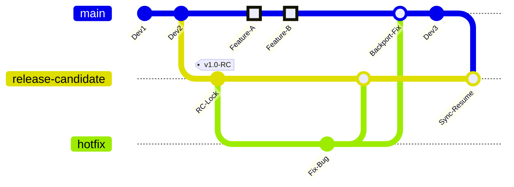

# Release Validation Process & Branching Strategy

## Overview

To improve our ability to validate releases without blocking development velocity, we are introducing a **Stabilization Workflow**.

Previously, the Stage environment (`rhsm-stage`) tracked `main`. This meant that new code changes could overwrite the environment while we were in the middle of validating a release candidate.

Going forward, **Stage will track a persistent branch named `release-candidate`.**

## The Workflow: Two Modes

We manage the synchronization between `main` and `release-candidate` via a GitHub Action. This places the repo in one of two modes:

### 🟢 Mode A: Continuous Development (Default)

- **Status:** The "Sync Stage with Main" workflow is **ENABLED**.
- **Behavior:** Every merge to `main` is automatically force-pushed to `release-candidate`.
- **Experience:** Stage behaves exactly as it always has—it updates automatically with the latest code.

### 🔴 Mode B: Release Stabilization (The Freeze)

- **Status:** The "Sync Stage with Main" workflow is **DISABLED**.
- **Behavior:** `release-candidate` is locked at a specific commit.
- **Experience:**
	- **Stage** will **stop updating** from `main`.
	- **Main** remains open. You can continue merging features/refactors to `main`, but they will **not** appear on Stage until the release is finalized.

---

## Developer Responsibilities

### 1. During Normal Operation (Mode A)

- **Action:** Work as usual. Create feature branches, open PRs against `main`.
- **Testing:** Verify your changes on Stage after merge.
    

### 2. During a Release Freeze (Mode B)

When a release is announced, Stage is "occupied."

- **Action:** You may continue to merge to `main`, but **DO NOT** expect your changes to deploy to Stage.
- **Testing:** You must rely on local testing or unit tests until the release window closes.
### 3. Fixing a Bug in the Release Candidate (CRITICAL)

If a critical bug is found during validation, we must fix it on the release candidate _without_ pulling in the new features sitting on `main`.

**The Hotfix Protocol:**

1. **Branch Source:** Create your hotfix branch based on `release-candidate` (NOT `main`).

  ```bash
git fetch origin
git checkout -b fix/critical-bug origin/release-candidate
```

2. **Target:** Open your PR against **`release-candidate`**.
3. **Verification:** Once merged, Stage will update automatically. Verify the fix.    
4. **The Backport Rule:** ⚠️ **YOU MUST** cherry-pick or merge this fix back into `main` immediately
	- _Why?_ If you fix it in the release but forget `main`, the bug will reappear in the next deployment.
	- This is similar to our existing process when we need to put out hotfixes.

---

## Visualizing the Flow

Code snippet



## FAQ

Q: How do I know if we are in a "Freeze"?
A: Check the #team-swatch channel to see if I've announced a deployment freeze lately (or check if the Sync Stage action is disabled in GitHub).

Q: I merged to main but Stage didn't update. Why?
A: We are likely validating a release. Your change is queued in main and will deploy to Stage once the release is promoted to Production and the sync is re-enabled.

Q: Can I push directly to release-candidate?
A: No. The branch is protected. You must use a PR.

---

## Implementation Details: What Do the Changes Look Like?

### Why the Sync Branches Approach?

**Minimal Infrastructure Impact:** This solution was specifically chosen to avoid the complexity of updating multiple CI/CD systems. Our current pipeline infrastructure includes:
- app-interface (GitOps deployment configs)
- swatch-ci (Jenkins CI definitions)
- konflux (build and delivery pipelines)
- Various other Jenkins jobs and automation

**Alternative approaches** (like creating new environments or defining new deployment targets) would require:
- New namespace definitions in app-interface
- New Jenkins job configurations in swatch-ci
- Additional konflux pipeline definitions
- Updates to monitoring, alerting, and access controls
- Coordination across multiple teams and infrastructure components

**The sync branches approach** requires only:
- One app-interface change (point to a different branch)
- One GitHub Action (handle the branch synchronization)
- No new infrastructure, no new Jenkins jobs, no complex multi-system changes

This keeps the implementation lightweight while solving the core problem of stage environment stability during release validation.

### 1. App-Interface Configuration Change

**One-Time Setup:** Update the rhsm-stage namespace configuration in app-interface to point to `release-candidate` instead of `main`.

```yaml
# In app-interface saas file
targets:
  - namespace:
      name: rhsm-stage
    ref: release-candidate  # Changed from "main"
```

**Why this works:** Once configured, you never need to touch app-interface again. The branch name stays the same; only the code inside that branch changes.

### 2. GitHub Actions Workflow - The "Auto-Sync Engine"

Create `.github/workflows/sync-stage.yaml` in your repository:

```yaml
name: Sync Stage with Main

# The Trigger: Runs on every push to main
on:
  push:
    branches:
      - main
  # Allows manual triggering from Actions tab
  workflow_dispatch:

jobs:
  sync-branch:
    runs-on: ubuntu-latest
    steps:
      - name: Checkout Code
        uses: actions/checkout@v4
        with:
          fetch-depth: 0 # Fetch all history so we can move branches
          token: ${{ secrets.GITHUB_TOKEN }}

      - name: Hard Reset Stage to Main
        run: |
          # Configure git bot user
          git config user.name "GitHub Action"
          git config user.email "action@github.com"

          # Force release-candidate to match main exactly
          git checkout -B release-candidate origin/main

          # Push the change (--force required for branch reset)
          git push origin release-candidate --force
```

**What this does:** Every time someone merges to `main`, this robot immediately updates `release-candidate` to match. Stage continues to behave exactly as it always has.

### 3. Branch Protection Rules

Configure branch protection for `release-candidate`:

- **Require pull request reviews before merging:** ✅ ON
- **Restrict pushes to matching branches:** Add admin team and GitHub Actions bot
- **Allow force pushes:** ✅ ON (required for the sync workflow)

**Why:** Prevents developers from accidentally pushing features to `release-candidate`. Forces them to use `main` (normal flow) or proper hotfix PRs (during freeze).

### 4. The Control Interface - Enabling/Disabling the Sync

**To Start a Release Freeze:**
1. Go to your GitHub repository
2. Click **Actions** tab
3. Click **"Sync Stage with Main"** in the left sidebar
4. Click the **three dots (...)** in the top right
5. Select **"Disable workflow"**
6. Announce in #team-swatch: "Stage is locked for release validation"

**To End a Release Freeze:**
1. Go back to **Actions** → **"Sync Stage with Main"**
2. Click **"Enable workflow"**
3. (Optional) Click **"Run workflow"** to immediately sync stage back to main
4. Announce: "Stage is back to tracking main"

### 5. Day-to-Day Operations Examples

#### Normal Development (Mode A - Sync Enabled)
```bash
# Developer workflow remains identical
git checkout -b feature/awesome-feature
# ... make changes ...
git push origin feature/awesome-feature
# Create PR against main, merge

# What happens automatically:
# 1. Main branch updates
# 2. GitHub Action triggers
# 3. release-candidate updates to match main
# 4. Stage environment redeploys
# 5. Integration tests run
```

#### Release Validation (Mode B - Sync Disabled)
```bash
# Tech lead decides to release
# 1. Disable sync workflow via GitHub UI
# 2. Current state is now "frozen" on stage

# If a critical bug is found during validation:
git fetch origin
git checkout -b hotfix/critical-bug origin/release-candidate
# ... fix the bug ...
git push origin hotfix/critical-bug

# Create PR against release-candidate (NOT main)
# Once merged:
# 1. Stage automatically updates with fix
# 2. Re-run validation tests
# 3. Cherry-pick the fix back to main:

git checkout main
git cherry-pick <hotfix-commit-sha>
git push origin main
```

#### Post-Release Cleanup
```bash
# After successful production deployment
# 1. Re-enable sync workflow via GitHub UI
# 2. Trigger manual run to catch up with main
# 3. Integration tests run against accumulated changes
```

### 6. Required Infrastructure Changes Summary

| Component | Current State | New State | Effort |
|-----------|---------------|-----------|---------|
| app-interface | Points to `main` | Points to `release-candidate` | 1 MR |
| GitHub Actions | None | Add sync workflow | 1 PR |
| Branch Protection | Protect `main` only | Protect `main` + `release-candidate` | GitHub UI config |
| Team Process | Manual stage management | Workflow enable/disable | Training |

### 7. Risk Mitigation Strategies

**The Integration Debt Problem:** During a freeze, `main` accumulates changes that aren't integration tested.

**Mitigation:**
- Keep freeze windows short (24-48 hours max)
- Immediately run full test suite when sync resumes
- Have "emergency break glass" procedure to bypass freeze if critical main branch issues arise

**The Hotfix Discipline Problem:** Fixes applied to `release-candidate` must be backported to `main`.

**Mitigation:**
- Make backporting part of the hotfix PR template
- Use GitHub issue templates that include backport checkboxes
- Consider automated cherry-pick workflows for simple fixes

**The Workflow Toggle Problem:** Humans must remember to enable/disable the sync.

**Mitigation:**
- Document the process in runbooks
- Add Slack reminders/automation
- Consider workflow status checks in deployment pipelines

