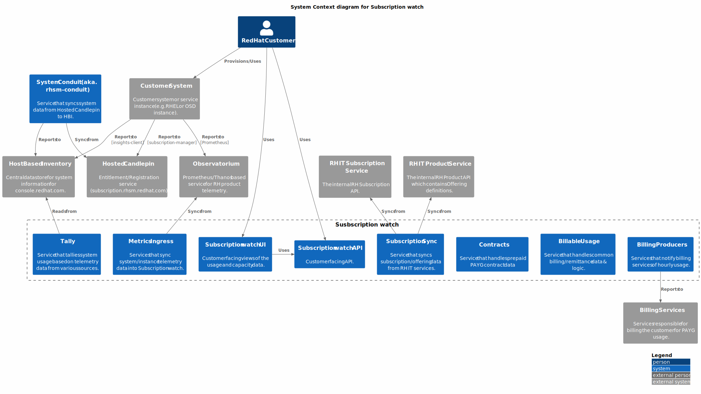
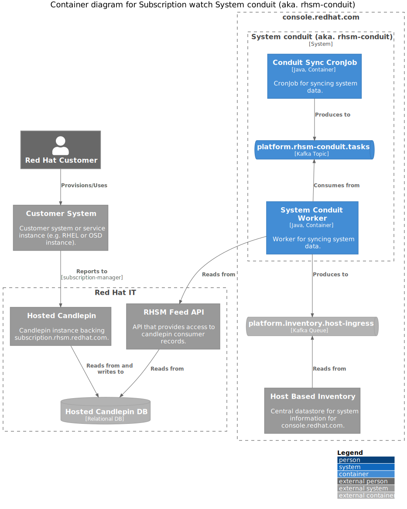
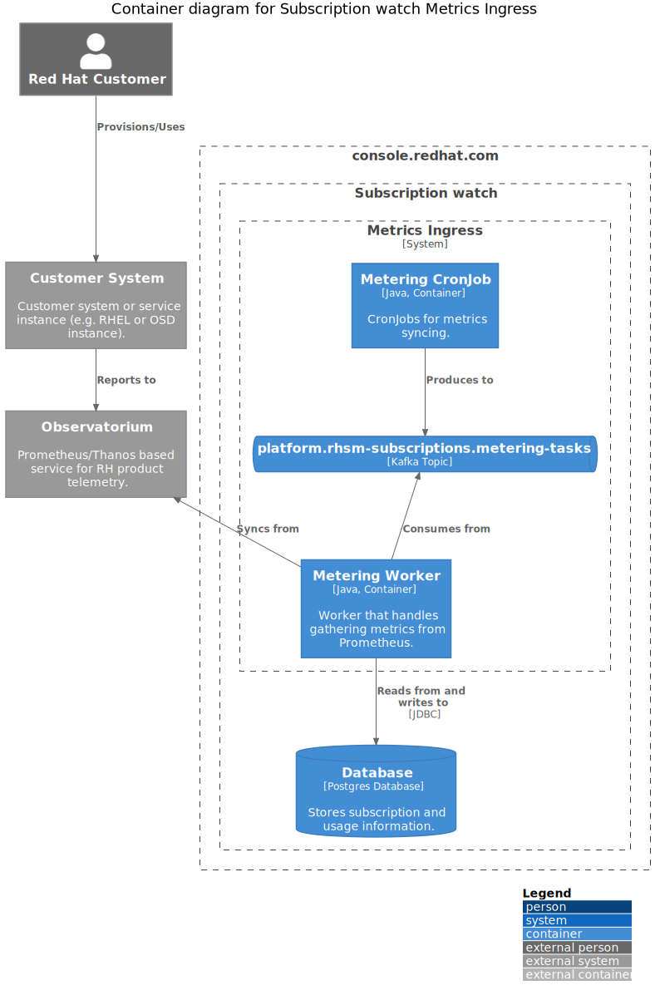
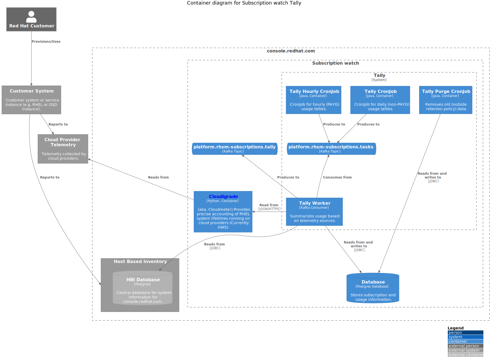
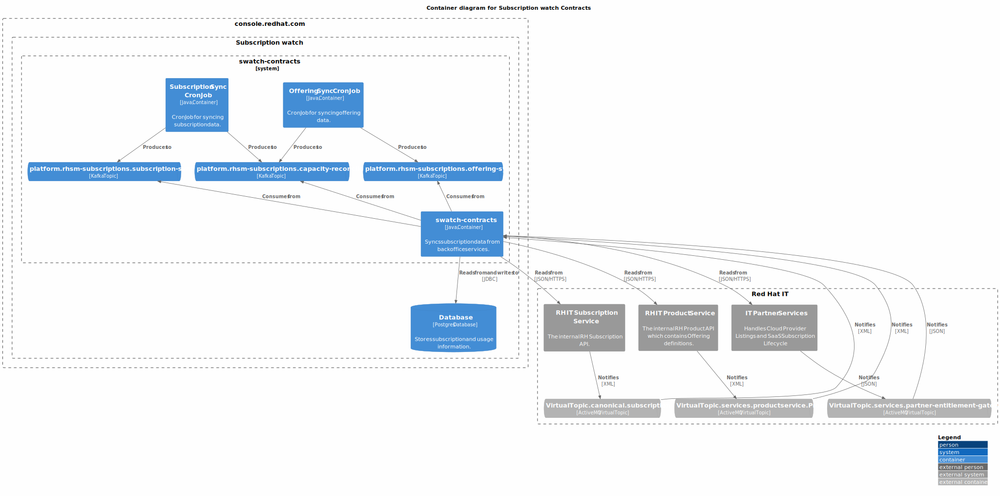
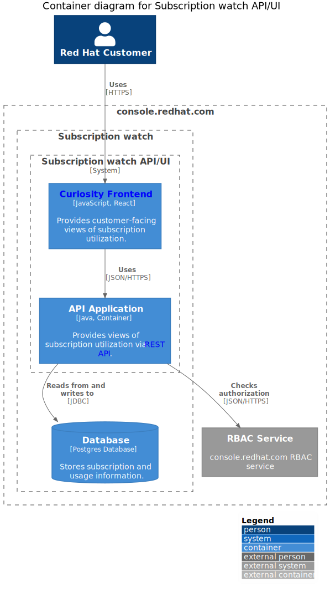
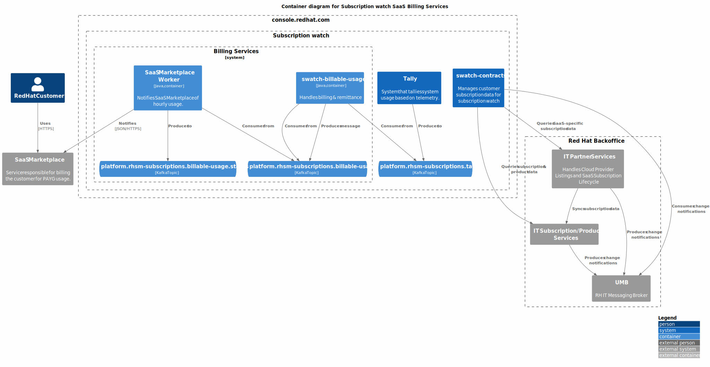
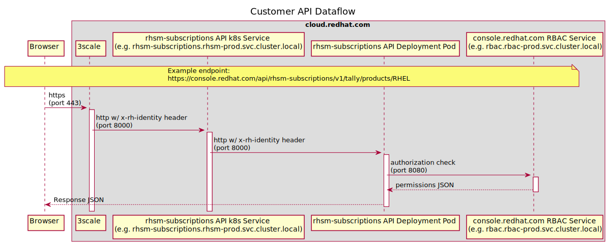
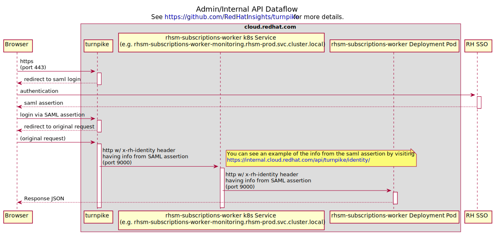

# Subscription watch

Subscription watch tracks usage and capacity at an account-level.
Account-level reporting means that subscriptions are not directly associated to machines,
containers, or service instances.



Subscription watch can be thought of as several services that provide related functionality:

<details>
<summary>system conduit</summary>
Service that syncs system data from Hosted Candlepin into HBI.


</details>

<details>
<summary>metrics ingress</summary>
Services that sync system/instance telemetry data into Subscription watch.


</details>

<details>
<summary>tally</summary>
Service that tallies system usage based on telemetry data from various sources.


</details>

<details>
<summary>subscription sync</summary>
Service that syncs subscription/offering data from RH IT services.


</details>

<details>
<summary>API/UI</summary>
Customer facing views of the usage and capacity data.


</details>

<details>
<summary>billing usage notification</summary>
Services that notify billing services of hourly usage.


</details>

Networking diagrams show how requests are routed:

<details>
<summary>Customer-facing API</summary>


</details>

<details>
<summary>Admin/Internal API</summary>


</details>

## Deployment

There are currently 3 different ways to deploy the components, with running them locally as the
preferred development workflow.

<details>
<summary>Local Development</summary>

### Prerequisites

First, ensure you have podman-compose, podman and java 11 installed:

```
sudo dnf install -y podman-compose podman java-17-openjdk-devel
```

*NOTE*: You can also use docker if don't want to or are unable to use podman. Make sure docker and docker-compose are installed.

Ensure the checkout has the HBI submodule initialized:

```
git submodule update --init --recursive
```

### Dependent services

NOTE: in order to deploy insights-inventory (not always useful), you'll need to login to quay.io first.

*NOTE*: To run any of the following commands using docker,

replace podman-compose with

```
docker compose
```

replace podman with

```
docker
```

Start via:
```
podman-compose up -d
```
If using docker, start via
```
docker compose up -d
```

*NOTE*: if the DB hasn't finished starting up (likely), HBI will fail to
start, to remedy: `podman start rhsm-subscriptions_inventory_1`.

For more details about what services are defined, see `docker-compose.yml`

Note that the compose assumes that none of the services are already running
locally (hint: might need to `sudo systemctl stop postgresql`). If you want to
use only some of the services via podman-compose, then `podman-compose up
--no-start` can be used to define the services (you can then subsequently
manually start containers for the services you wish to deploy locally.

If you prefer to use local postgresql service, you can use `init_dbs.sh`.

### Kafka

`podman-compose` deploys a kafka instance w/ a UI at http://localhost:3030

Two environment variables can be used to manipulate the offsets of the kafka
consumers:

- `KAFKA_SEEK_OVERRIDE_END` when set to `true` seeks to the very end
- `KAFKA_SEEK_OVERRIDE_TIMESTAMP` when set to an OffsetDateTime, seeks the
  queue to this position.

These changes are permanent, committed the next time the kafka consumer is detected
as idle.

### Build and Run rhsm-subscriptions

```
./gradlew :bootRun
```

Spring Boot [defines many properties](https://docs.spring.io/spring-boot/docs/2.3.4.RELEASE/reference/htmlsingle/#common-application-properties)
that can be overridden via args or environment variables. (We prefer
environment variables). To determine the environment variable name,
uppercase, remove dashes and replace `.` with `_` (per
[Spring docs](https://docs.spring.io/spring-boot/docs/2.3.4.RELEASE/reference/htmlsingle/#boot-features-external-config-relaxed-binding-from-environment-variables))
We also define a number of service-specific properties (see [Environment Variables](#environment-variables))

For example, the `server.port` (or `SERVER_PORT` env var) property changes the listening port:

```
SERVER_PORT=9090 ./gradlew :bootRun
```

### Profiles

We have a number of profiles. Each profile activates a subset of components in the codebase.

- `api`: Run the user-facing API
- `capacity-ingress`: Run the internal only capacity ingress API
- `capture-hourly-snapshots`: Run the tally job for hourly snapshots
- `capture-snapshots`: Run the tally job and exit
- `kafka-queue`: Run with a kafka queue (instead of the default in-memory queue)
- `liquibase-only`: Run the Liquibase migrations and stop
- `rh-marketplace`: Run the worker responsible for processing tally summaries and
  emitting usage to Red Hat Marketplace.
- `metering-job`: Create metering jobs and place them on the job queue
- `openshift-metering-worker`: Process OpenShift metering jobs off the job queue
- `purge-snapshots`: Run the retention job and exit
- `worker`: Process jobs off the job queue

These can be specified most easily via the `SPRING_PROFILES_ACTIVE` environment variable. For example:

```
SPRING_PROFILES_ACTIVE=capture-snapshots,kafka-queue ./gradlew bootRun
```

Each profile has a `@Configuration` class that controls which components get activated, See ApplicationConfiguration for more details.

If no profiles are specified, the default profiles list in `application.yaml` is applied.

### Deployment Notes

RHSM Subscriptions is meant to be deployed under the context path "/". The
location of app specific resources are then controlled by the
`rhsm-subscriptions.package_uri_mappings.org.candlepin.insights` property.
This unusual configuration is due to external requirements that our
application base its context path on the value of an environment
variable. Using "/" as the context path means that we can have certain
resources (such as health checks) with a known, static name while others
can vary based on an environment variable given to the pod.

### Static Endpoints

These are served on port 9000. When running locally, you can access them via
http://localhost:9000.

* /jolokia - REST access to JMX beans via Jolokia
* /hawtio - Admin UI interface to JMX beans and more
* /health - A Spring Actuator that we use as k8s
  liveness/readiness probe.
* /info - An actuator that reads the information from
  `META-INF/build-info.properties` and reports it. The response includes
  things like the version number.

Both the health actuator and info actuator can be modified, expanded, or
extended. Please see the
[documentation](https://docs.spring.io/spring-boot/docs/current/reference/html/production-ready-endpoints.html)
for a discussion of extension points.

### RBAC

rhsm-subscriptions uses an RBAC service to determine application authorization. The
RBAC service can via configured by environment variables (see below).

For development purposes, the RBAC service can be stubbed out so that the connection
to the RBAC service is bypassed and all users recieve the 'subscriptions:*:*' role. This
can be enabled by setting `RHSM_RBAC_USE_STUB=true`

```sh
RHSM_RBAC_USE_STUB=true ./gradlew bootRun
```

### Environment Variables

* `DEV_MODE`: disable anti-CSRF, account filtering, and RBAC role check
* `DEVTEST_SUBSCRIPTION_EDITING_ENABLED`: allow subscription/offering edits via JMX.
* `DEVTEST_EVENT_EDITING_ENABLED`: allow event edits via JMX.
* `PRETTY_PRINT_JSON`: configure Jackson to indent outputted JSON
* `APP_NAME`: application name for URLs (default: rhsm-subscriptions)
* `PATH_PREFIX`: path prefix in the URLs (default: api)
* `INVENTORY_USE_STUB`: Use stubbed inventory REST API
* `INVENTORY_API_KEY`: API key for inventory service
* `HOST_LAST_SYNC_THRESHOLD`: reject hosts that haven't checked in since this duration (e.g. 24h)
* `INVENTORY_DATABASE_HOST`: inventory DB host
* `INVENTORY_DATABASE_DATABASE`: inventory DB database
* `INVENTORY_DATABASE_USERNAME`: inventory DB user
* `INVENTORY_DATABASE_PASSWORD`: inventory DB password
* `PRODUCT_DENYLIST_RESOURCE_LOCATION`: location of the product denylist
* `ACCOUNT_LIST_RESOURCE_LOCATION`: location of the account list (opt-in used otherwise)
* `DATABASE_HOST`: DB host
* `DATABASE_PORT`: DB port
* `DATABASE_DATABASE`: DB database
* `DATABASE_USERNAME`: DB username
* `DATABASE_PASSWORD`: DB password
* `CAPTURE_SNAPSHOT_SCHEDULE`: cron schedule for capturing tally snapshots
* `ACCOUNT_BATCH_SIZE`: number of accounts to tally at once
* `TALLY_RETENTION_HOURLY`: number of hourly tallies to keep
* `TALLY_RETENTION_DAILY`: number of daily tallies to keep
* `TALLY_RETENTION_WEEKLY`: number of weekly tallies to keep
* `TALLY_RETENTION_MONTHLY`: number of monthly tallies to keep
* `TALLY_RETENTION_QUARTERLY`: number of quarterly tallies to keep
* `TALLY_RETENTION_YEARLY`: number of yearly tallies to keep
* `KAFKA_TOPIC`: topic for rhsm-subscriptions tasks
* `KAFKA_GROUP_ID` kafka consumer group ID
* `KAFKA_CONSUMER_MAX_POLL_INTERVAL_MS`: kafka max poll interval in milliseconds
* `KAFKA_MESSAGE_THREADS`: number of consumer threads
* `KAFKA_BOOTSTRAP_HOST`: kafka bootstrap host
* `KAFKA_BOOTSTRAP_PORT`: kafka boostrap port
* `KAFKA_CONSUMER_RECONNECT_BACKOFF_MS`: kafka consumer reconnect backoff in milliseconds
* `KAFKA_CONSUMER_RECONNECT_BACKOFF_MAX_MS`: kafka consumer reconnect max backoff in milliseconds
* `KAFKA_API_RECONNECT_TIMEOUT_MS`: kafka connection timeout in milliseconds
* `RHSM_RBAC_USE_STUB`: stub out the rbac service
* `RHSM_RBAC_APPLICATION_NAME`: name of the RBAC permission application name (`<APP_NAME>:*:*`),
  by default this property is set to 'subscriptions'.
* `RHSM_RBAC_HOST`: RBAC service hostname
* `RHSM_RBAC_PORT`: RBAC service port
* `RHSM_RBAC_MAX_CONNECTIONS`: max concurrent connections to RBAC service
* `SWATCH_*_PSK`: pre-shared keys for internal service-to-service authentication
  where the `*` represents the name of an authorized service
* `ENABLE_SYNCHRONOUS_OPERATIONS`: allow any supported APIs to bypass kafka and run the operation immediately when requested.

</details>

<details>
<summary>Clowder</summary>

Clowder exposes the services it provides in an Openshift config map.  This config map appears
in the container as a JSON file located by default at the path defined by `ACG_CONFIG` environment
variable (typically `/cdapp/cdappconfig.json`).  The `ClowderJsonEnvironmentPostProcessor` takes
this JSON file and flattens it into Java style properties (with the namespace `clowder` prefixed).
For example,

```json
{ "kafka": {
  "brokers": [{
    "hostname": "localhost"
  }]
}}
```

Becomes `clowder.kafka.brokers[0].hostname`.  These properties are then passed into the Spring
Environment and may be used elsewhere (the `ClowderJsonEnvironmentPostProcessor` runs *before*
most other environment processing classes).

The pattern we follow is to assign the Clowder style properties to an **intermediate** property
that follows Spring Boot's environment variable
[binding conventions](https://docs.spring.io/spring-boot/docs/current/reference/htmlsingle/#features.external-config.typesafe-configuration-properties.relaxed-binding.environment-variables)

It is important to note, this intermediate property ***must*** be given a default via the `$
{value:default}` syntax.  If a default is not provided *and* the Clowder JSON is not available
(such as in development runs), Spring will fail to start because the `clowder.` property will
not resolve to anything.

An example of an intermediate property would be

```
KAFKA_BOOTSTRAP_HOST=${clowder.kafka.brokers[0].hostname:localhost}
```

This pattern has the useful property of allowing us to override any Clowder settings (in
development, for example) with environment variables since a value specified in the environment
has a higher [precedence](https://docs.spring.io/spring-boot/docs/current/reference/htmlsingle/#features.external-config)
than values defined in config data files (e.g. `application.properties`).

The intermediate property is then assigned to any actual property that we wish to use, e.g.
`spring.kafka.bootstrap-servers`.  Thus, it is trivial to either allow a value to be specified
by Clowder, overridden from Clowder via environment variable, or not given by Clowder at all and
instead based on a default.

A Clowder environment can be simulated in development by pointing the `ACG_CONFIG` environment var
to a mock Clowder JSON file.

E.g.
```
$ ACG_CONFIG=$(pwd)/swatch-core/src/test/resources/test-clowder-config.json ./gradlew bootRun
```

### Viewing Kafka messages in an ephemeral environment

1. Get a token and login via `oc login`.
2. Switch to the ephemeral namespace via `oc project $namespace`
3. Remotely exec kakfa-console-consumer.sh with the desired topic (replace `$topic` below):

```
oc rsh \
  $(oc get pod -o name -l app.kubernetes.io/name=kafka) \
  bin/kafka-console-consumer.sh \
  --topic $topic \
  --from-beginning \
  --bootstrap-server localhost:9092
```

</details>

<details>
<summary>Deploy to Openshift via Templates</summary>

Prerequisite secrets:

- `pinhead`: secret with `keystore.jks` - keystore for HTTPS communication with RHSM API (formerly Pinhead).
- `swatch-tally-db`: DB connection info, having `db.host`, `db.port`, `db.user`, `db.password`, and `db.name` properties.
- `host-inventory-db-readonly`: inventory read-only clone DB connection info, having `db.host`, `db.port`, `db.user`, `db.password`, and `db.name` properties.
- `ingress`: secret with `keystore.jks` and `truststore.jks` - keystores for mTLS communication with subscription-conduit.
- `tls`: having `keystore.password`, the password used for capacity ingress.

Prequisite configmaps:
- `capacity-denylist` having `product-denylist.txt` which is a newline-separated list of which SKUs have been approved for capacity ingress.

Adjust as desired:

```
oc process -f templates/rhsm-subscriptions-api.yml | oc create -f -
oc process -f templates/rhsm-subscriptions-capacity-ingress.yml | oc create -f -
oc process -f templates/rhsm-subscriptions-scheduler.yml | oc create -f -
oc process -f templates/rhsm-subscriptions-worker.yml | oc create -f -
```

</details>
<details>
<summary>Deploying with Bonfire</summary>

* `sudo dnf install golang`

* Install `bonfire` following the instructions [here](https://github.com/RedHatInsights/bonfire#installation)

* Configure `bonfire` to use your checkout.  This cat command is just a
  short-cut so the instructions will be succinct.  You should open the file and
  paste in the name and component bits yourself under the `apps:` key.  If you
  paste in the contents, replace `$(pwd)` with the directory where your
  subscription-watch checkout is

  You can override parameters as shown below, or alternatively with the bonfire
  `-p` argument during the deploy step.  The parameters in the example below are
  useful for development environments.

```bash
bonfire config write-default

cat <<BONFIRE >>  ~/.config/bonfire/config.yaml
- name: rhsm #Name of app-sre 'application' folder this component lives in
  components:
    - name: swatch-tally
      host: local
      repo: $(pwd)/swatch-tally
      path: /deploy/clowdapp.yaml
      parameters:
        REPLICAS: 1
        DEV_MODE: "true"
        swatch-tally/IMAGE: quay.io/cloudservices/rhsm-subscriptions
        RHSM_RBAC_USE_STUB: "true"
        
    - name: swatch-producer-red-hat-marketplace
      host: local
      repo: $(pwd)/rhsm-subscriptions/swatch-producer-red-hat-marketplace
      path: /deploy/clowdapp.yaml
      parameters:
        REPLICAS: 1

    - name: swatch-metrics
      host: local
      repo: $(pwd)/swatch-metrics
      path: /deploy/clowdapp.yaml
      parameters:
        DEV_MODE: "true"
        REPLICAS: 1
        swatch-metrics/IMAGE: quay.io/cloudservices/rhsm-subscriptions

    - name: swatch-subscription-sync
      host: local
      repo: $(pwd)/swatch-subscription-sync
      path: /deploy/clowdapp.yaml
      parameters:
        DEV_MODE: "true"
        REPLICAS: 1
        swatch-subscription-sync/IMAGE: quay.io/cloudservices/rhsm-subscriptions

    - name: swatch-system-conduit
      host: local
      repo: $(pwd)/swatch-system-conduit
      path: /deploy/clowdapp.yaml
      parameters:
        REPLICAS: 1
        swatch-system-conduit/IMAGE: quay.io/cloudservices/swatch-system-conduit

    - name: swatch-api
      host: local
      repo: $(pwd)/rhsm-subscriptions/swatch-api
      path: /deploy/clowdapp.yaml
      parameters:
        REPLICAS: 1
        swatch-api/IMAGE: quay.io/cloudservices/rhsm-subscriptions
        RHSM_RBAC_USE_STUB: "true"

    - name: swatch-producer-aws
      host: local
      repo: $(pwd)/rhsm-subscriptions/swatch-producer-aws
      path: /deploy/clowdapp.yaml
      parameters:
        REPLICAS: 1
        swatch-producer-aws/IMAGE: quay.io/cloudservices/swatch-producer-aws
    
    - name: swatch-contracts
      host: local
      repo: $(pwd)/rhsm-subscriptions/swatch-contracts
      path: /deploy/clowdapp.yaml
      parameters:
        REPLICAS: 1
        swatch-contracts/IMAGE: quay.io/cloudservices/swatch-contracts
BONFIRE
```

### Ephemeral Development and Deployment
The definitive reference is going to be the "Onboarding to the Ephemeral
Cluster" page in the Cloud-dot documentation, but here are some essentials:

* Make sure you’re part of the
  [RedHatInsights](https://github.com/RedHatInsights) GitHub org and a member of
  the `ephemeral-users` role in your file under the `users` directory in
  app-interface.

* Install `oc` from the `CLI Tools Download Page` on the cluster.

* Activate your virtualenv for Bonfire
    * `source $ENV_LOCATION/bin/activate`

* Namespaces can be reserved with `bonfire`.  E.g. `bonfire namespace reserve
  --duration HOURS` will reserve a random available namespace for the number of
  hours you specify.  You can always increase a reservation by reserving the
  namespace again: `bonfire namespace reserve NAMESPACE`.

* Create an account on `quay.io` and create an image repository for each
  component (Currently, one for rhsm-subscriptions and one for
  swatch-system-conduit).  Use `podman login` or `docker login` so that you
  can build and push your test images there.

* You can do the builds with the script in `bin/build-images.sh`.

  By default, bonfire/clowder use the first 7 characters of the git hash as the
  image tag.  Note that currently Clowder has an enforced image pull policy of
  "IfNotPresent" so using a static tag (even "latest") is not a workable option.

* When you deploy with bonfire during development, you'll want to specify the
  image and image tag you want to use like so:

  ```
  bonfire deploy rhsm-subscriptions -n NAMESPACE --no-remove-resources=rhsm-subscriptions
  -i quay.io/my-repo/my-image=my-tag -p rhsm-subscriptions/IMAGE=quay.io/my-repo/my-image
  -i quay.io/my-repo/my-conduit-image=my-tag -p rhsm-subscriptions/CONDUIT_IMAGE=quay.
  io/my-repo/my-conduit-image
  ```

  The `-i` argument overrides the image tag that you're using.  The `-p`
  overrides parameters in specific ClowdApp components (defined in
  `~/.config/bonfire/config.yaml`).  In this case, we override the `IMAGE`
  and `CONDUIT_IMAGE` parameters in our template with the image to use.

  Note that you can also locally change the images used without the
  parameters - simply add `IMAGE` and `CONDUIT_IMAGE` to `parameters` in
  `~/.config/bonfire/config.yaml`. (If you do this, the `-p` arguments to
  `bonfire` are redundant)

  If you don't specify the tag to use with `-i` bonfire is going to use the
  first 7 characters of the git hash for HEAD.  If you don't specify the repo
  with the `-p` argument, `bonfire` is going to use what's defined in the
  ClowdApp which is going to be the production image that's been pushed to the
  official repo.

  The `--no-remove-resources=all` argument is extremely important. Without it,
  bonfire will process the template and will **not** include our resource
  requests. This "feature" is to prevent apps from requesting too much but the
  default resources given are vastly insufficient for our purposes.

* If you want to reset your ephemeral environment from the RHSM stuff entirely,
  you can delete the special "app" resource that Clowder creates.  So `oc delete
  app rhsm` will essentially delete all the pods, deployments, etc. associate
  with RHSM while leaving other apps (like RBAC) in place.

* Expose your pods using `oc port-forward`

* Here's a one-liner to see who has what ephemeral environment reserved

  ```shell
  oc get project -l ephemeral-ns-reserved -L ephemeral-ns-requester-name,ephemeral-ns-reserved
  ```

* Here's a way to monitor events (useful for tracking down deployment issues)

  ```shell
  oc get events --sort-by=.metadata.creationTimestamp
  ```

# Special Notes
## bonfire "deploy" command and namespace reservation
If you use `bonfire deploy` without already having a namespace reserved, it will
reserve the namespace for you **BUT** if the app doesn't start up in the default
amount of time, bonfire will take down/give up the namespace it reserved to
begin with.  To get around this, you can manually reserve the namespace, then
pass `-n <NAMESPACE>` as an argument when running `bonfire deploy`.

# TL;DR Quickstart Steps
1. Start bonfire virtual environment
2. Reserve a namespace
4. Deploy rhsm with `bonfire deploy -n NAMESPACE`

</details>

## Release Process

Merges to `main` will trigger deployment to a preprod environment. Production
deployments will be handled in an internal App-SRE automation repo.

## Grafana Dashboards

See App-SRE documentation on updating dashboards for more info.

Essentially:

1. Edit the dashboard on the stage grafana instance.
2. Export the dashboard, choosing to "export for sharing externally", save JSON to a file.
3. Export the dashboard again, this time not selecting the external sharing option and save that
   JSON to a file.
4. For both pieces of JSON, drop them into the `subscription-watch.json` section under `data`
   in `grafana-dashboard-subscription-watch.configmap.yaml` and update the indentation.
5. Do a `git diff`.  Select the export that makes the most sense.  In my experience, **not**
   selecting the "external sharing" option leads to more correct results.  A export formatted
   for sharing has an `__inputs` section that hardcodes some values we don't want hardcoded.
6. Rename the file to `subscription-watch.json`.

OR

1. Edit the dashboard on the stage grafana instance.
2. Navigate to Dashboard Settings (cogwheel top right of page)
3. Navigate to JSON Model (left nav)
4. Save contents of the JSON Model into a file named `subscription-watch.json`.

Use the following command to update the configmap YAML:

```
oc create configmap grafana-dashboard-subscription-watch --from-file=subscription-watch.json -o yaml --dry-run=client > ./grafana-dashboard-subscription-watch.configmap.yaml
cat << EOF >> ./grafana-dashboard-subscription-watch.configmap.yaml
  annotations:
    grafana-folder: /grafana-dashboard-definitions/Insights
  labels:
    grafana_dashboard: "true"
EOF
```


Possibly useful, to extract the JSON from the k8s configmap file:

```
oc extract -f dashboards/grafana-dashboard-subscription-watch.configmap.yaml --confirm
```

Once you extract it from the .yaml that's checked into this repo, you can import it into the stage instance of grafana by going to Create -> Import from the left nav.

## APIs

Links to Swagger UI and API specs:

* [Customer-facing API][customer-api]
  ([source](api/rhsm-subscriptions-api-spec.yaml))
* [Internal Billing Producer API][billing-api]
  ([source](src/main/spec/internal-billing-api-spec.yaml))
* [Internal Metering API][metering-api]
  ([source](src/main/spec/internal-metering-api-spec.yaml))
* [Internal Subscriptions API][subscriptions-api]
  ([source](src/main/spec/internal-subscriptions-sync-api-spec.yaml))
* [Internal Tally API][tally-api]
  ([source](src/main/spec/internal-tally-api-spec.yaml))
* [Internal Contracts API][contracts-api]
  ([source](swatch-contracts/src/main/resources/META-INF/openapi.yaml))
* [Internal AWS Producer API][aws-api]
  ([source](swatch-producer-aws/src/main/resources/openapi.yaml))
* [Internal System Conduit API][conduit-api]
  ([source](swatch-system-conduit/src/main/spec/internal-organizations-sync-api-spec.yaml))

[customer-api]:       https://petstore.swagger.io/?url=https://raw.githubusercontent.com/RedHatInsights/rhsm-subscriptions/main/api/rhsm-subscriptions-api-spec.yaml
[billing-api]:        https://petstore.swagger.io/?url=https://raw.githubusercontent.com/RedHatInsights/rhsm-subscriptions/main/src/main/spec/internal-billing-api-spec.yaml
[metering-api]:       https://petstore.swagger.io/?url=https://raw.githubusercontent.com/RedHatInsights/rhsm-subscriptions/main/src/main/spec/internal-metering-api-spec.yaml
[subscriptions-api]:  https://petstore.swagger.io/?url=https://raw.githubusercontent.com/RedHatInsights/rhsm-subscriptions/main/src/main/spec/internal-subscriptions-sync-api-spec.yaml
[tally-api]:          https://petstore.swagger.io/?url=https://raw.githubusercontent.com/RedHatInsights/rhsm-subscriptions/main/src/main/spec/internal-tally-api-spec.yaml
[contracts-api]:      https://petstore.swagger.io/?url=https://raw.githubusercontent.com/RedHatInsights/rhsm-subscriptions/main/swatch-contracts/src/main/resources/META-INF/openapi.yaml
[aws-api]:            https://petstore.swagger.io/?url=https://raw.githubusercontent.com/RedHatInsights/rhsm-subscriptions/main/swatch-producer-aws/src/main/resources/openapi.yaml
[conduit-api]:        https://petstore.swagger.io/?url=https://raw.githubusercontent.com/RedHatInsights/rhsm-subscriptions/main/swatch-system-conduit/src/main/spec/internal-organizations-sync-api-spec.yaml

## Kafka topics
<details>
<summary>Topics with their associated profiles and pods</summary>
Service that syncs system data from Hosted Candlepin into HBI.

| profile                   | topic(s)                                       | openshift pod                       |
| ------------------------- | ---------------------------------------------- | ----------------------------------- |
| openshift-metering-worker | platform.rhsm-subscriptions.metering-tasks     | swatch-metrics                      |
| metering-job              | platform.rhsm-subscriptions.metering-tasks     | swatch-metrics-sync                 |
| orgsync                   | platform.rhsm-conduit.tasks                    | swatch-system-conduit-sync          |
| orgsync                   | platform.rhsm-conduit.tasks                    | swatch-system-conduit               |
|                           | platform.inventory.host-ingress                | swatch-system-conduit               |
| worker                    | platform.rhsm-subscriptions.tasks              | swatch-tally                        |
| worker                    | platform.rhsm-subscriptions.tally              | swatch-tally                        |
| worker                    | platform.rhsm-subscriptions.billable-usage     | swatch-tally                        |
| purge-snapshots           |                                                |                                     |
| capture-hourly-snapshots  | platform.rhsm-subscriptions.tasks              | swatch-tally-hourly                 |
| capture-snapshots         | platform.rhsm-subscriptions.tasks              | swatch-tally-tally                  |
| rh-marketplace            | platform.rhsm-subscriptions.billable-usage     | swatch-producer-red-hat-marketplace |
|                           | platform.rhsm-subscriptions.billable-usage     | swatch-producer-aws                 |
| subscription-sync         | platform.rhsm-subscriptions.subscription-sync  | swatch-subscription-sync-sync       |
| offering-sync             | platform.rhsm-subscriptions.offering-sync      | swatch-subscription-sync-offering   |
| capacity-ingress          | platform.rhsm-subscriptions.subscription-sync  | swatch-subscriptions-sync           |
| capacity-ingress          | platform.rhsm-subscriptions.offering-sync      | swatch-subscriptions-sync           |
| capacity-ingress          | platform.rhsm-subscriptions.capacity-reconcile | swatch-subscriptions-sync           |
| capacity-ingress          | platform.rhsm-subscriptions.subscription-prune | swatch-subscriptions-sync           |
</details>

## BASILISK (placeholder/testing PAYG product)

In order to generate mock data for BASILISK, use `PRODUCT=BASILISK bin/prometheus-mock-data.sh` (this generates mock data into a prometheus process),
or use `bin/import-events.py --file bin/BASILISK.csv` to import BASILISK data directly in, bypassing prometheus.

## License

Subscription watch components are licensed GPLv3 (see LICENSE for more details).
