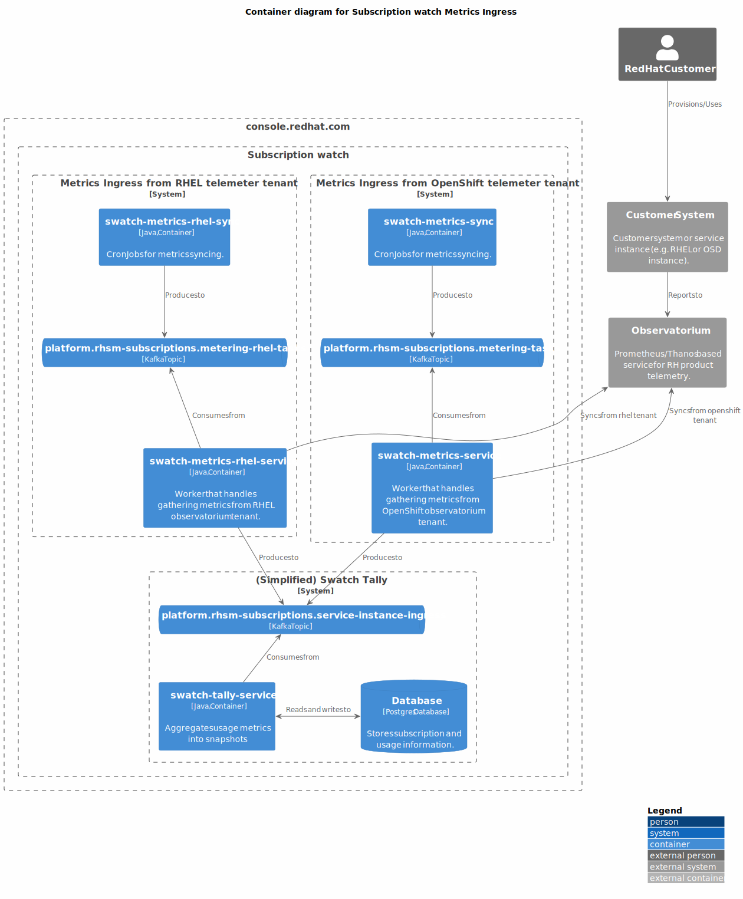

# Subscription watch

Subscription watch tracks usage and capacity at an account-level.
Account-level reporting means that subscriptions are not directly associated to machines,
containers, or service instances.


Subscription watch can be thought of as several services that provide related functionality:

<details>
<summary>system conduit</summary>
Service that syncs system data from Hosted Candlepin into HBI.


</details>

<details>
<summary>metrics ingress</summary>
Services that sync system/instance telemetry data into Subscription watch.


</details>

<details>
<summary>tally</summary>
Service that tallies system usage based on telemetry data from various sources.


</details>

<details>
<summary>subscription sync</summary>
Service that syncs subscription/offering data from RH IT services.


</details>

<details>
<summary>API/UI</summary>
Customer facing views of the usage and capacity data.


</details>

<details>
<summary>billing usage notification</summary>
Services that notify billing services of hourly usage.


</details>

Networking diagrams show how requests are routed:

<details>
<summary>Customer-facing API</summary>


</details>

<details>
<summary>Admin/Internal API</summary>


</details>

## Deployment

There are currently 3 different ways to deploy the components, with running them locally as the 
preferred development workflow.

<details>
<summary>Local Development</summary>

### Prerequisites

First, ensure you have podman-compose, podman and java 11 installed:

```
sudo dnf install -y podman-compose podman java-11-openjdk-devel
```

*NOTE*: You can also use docker if don't want to or are unable to use podman. Make sure docker and docker-compose are installed.

Ensure the checkout has the HBI submodule initialized:

```
git submodule update --init --recursive
```

### Dependent services

NOTE: in order to deploy insights-inventory (not always useful), you'll need to login to quay.io first.

*NOTE*: To run any of the following commands using docker, 

replace podman-compose with

```
docker compose
```

replace podman with

```
docker
```

Start via:
```
podman-compose up -d
```
If using docker, start via
```
docker compose up -d
```

*NOTE*: if the DB hasn't finished starting up (likely), HBI will fail to
start, to remedy: `podman start rhsm-subscriptions_inventory_1`.

For more details about what services are defined, see `docker-compose.yml`

Note that the compose assumes that none of the services are already running
locally (hint: might need to `sudo systemctl stop postgresql`). If you want to
use only some of the services via podman-compose, then `podman-compose up
--no-start` can be used to define the services (you can then subsequently
manually start containers for the services you wish to deploy locally.

If you prefer to use local postgresql service, you can use `init_dbs.sh`.

### Kafka

`podman-compose` deploys a kafka instance w/ a UI at http://localhost:3030

Two environment variables can be used to manipulate the offsets of the kafka
consumers:

- `KAFKA_SEEK_OVERRIDE_END` when set to `true` seeks to the very end
- `KAFKA_SEEK_OVERRIDE_TIMESTAMP` when set to an OffsetDateTime, seeks the
  queue to this position.

These changes are permanent, committed the next time the kafka consumer is detected
as idle.

### Build and Run rhsm-subscriptions

```
./gradlew :bootRun
```

Spring Boot [defines many properties](https://docs.spring.io/spring-boot/docs/2.3.4.RELEASE/reference/htmlsingle/#common-application-properties)
that can be overridden via args or environment variables. (We prefer
environment variables). To determine the environment variable name,
uppercase, remove dashes and replace `.` with `_` (per
[Spring docs](https://docs.spring.io/spring-boot/docs/2.3.4.RELEASE/reference/htmlsingle/#boot-features-external-config-relaxed-binding-from-environment-variables))
We also define a number of service-specific properties (see [Environment Variables](#environment-variables))

For example, the `server.port` (or `SERVER_PORT` env var) property changes the listening port:

```
SERVER_PORT=9090 ./gradlew :bootRun
```

### Profiles

We have a number of profiles. Each profile activates a subset of components in the codebase.

- `api`: Run the user-facing API
- `capacity-ingress`: Run the internal only capacity ingress API
- `capture-hourly-snapshots`: Run the tally job for hourly snapshots
- `capture-snapshots`: Run the tally job and exit
- `kafka-queue`: Run with a kafka queue (instead of the default in-memory queue)
- `liquibase-only`: Run the Liquibase migrations and stop
- `rh-marketplace`: Run the worker responsible for processing tally summaries and
  emitting usage to Red Hat Marketplace.
- `metering-jmx`: Expose the JMX bean to create metering jobs
- `metering-job`: Create metering jobs and place them on the job queue
- `openshift-metering-worker`: Process OpenShift metering jobs off the job queue
- `purge-snapshots`: Run the retention job and exit
- `worker`: Process jobs off the job queue

These can be specified most easily via the `SPRING_PROFILES_ACTIVE` environment variable. For example:

```
SPRING_PROFILES_ACTIVE=capture-snapshots,kafka-queue ./gradlew bootRun
```

Each profile has a `@Configuration` class that controls which components get activated, See ApplicationConfiguration for more details.

If no profiles are specified, the default profiles list in `application.yaml` is applied.

### Deployment Notes

RHSM Subscriptions is meant to be deployed under the context path "/". The
location of app specific resources are then controlled by the
`rhsm-subscriptions.package_uri_mappings.org.candlepin.insights` property.
This unusual configuration is due to external requirements that our
application base its context path on the value of an environment
variable. Using "/" as the context path means that we can have certain
resources (such as health checks) with a known, static name while others
can vary based on an environment variable given to the pod.

### Static Endpoints

These are served on port 9000. When running locally, you can access them via
http://localhost:9000.

* /jolokia - REST access to JMX beans via Jolokia
* /hawtio - Admin UI interface to JMX beans and more
* /health - A Spring Actuator that we use as k8s
  liveness/readiness probe.
* /info - An actuator that reads the information from
  `META-INF/build-info.properties` and reports it. The response includes
  things like the version number.

Both the health actuator and info actuator can be modified, expanded, or
extended. Please see the
[documentation](https://docs.spring.io/spring-boot/docs/current/reference/html/production-ready-endpoints.html)
for a discussion of extension points.

### RBAC

rhsm-subscriptions uses an RBAC service to determine application authorization. The
RBAC service can via configured by environment variables (see below).

For development purposes, the RBAC service can be stubbed out so that the connection
to the RBAC service is bypassed and all users recieve the 'subscriptions:*:*' role. This
can be enabled by setting `RHSM_RBAC_USE_STUB=true`

```sh
RHSM_RBAC_USE_STUB=true ./gradlew bootRun
```

### Environment Variables

* `DEV_MODE`: disable anti-CSRF, account filtering, and RBAC role check
* `DEVTEST_SUBSCRIPTION_EDITING_ENABLED`: allow subscription/offering edits via JMX.
* `DEVTEST_EVENT_EDITING_ENABLED`: allow event edits via JMX.
* `PRETTY_PRINT_JSON`: configure Jackson to indent outputted JSON
* `APP_NAME`: application name for URLs (default: rhsm-subscriptions)
* `PATH_PREFIX`: path prefix in the URLs (default: api)
* `INVENTORY_USE_STUB`: Use stubbed inventory REST API
* `INVENTORY_API_KEY`: API key for inventory service
* `INVENTORY_HOST_LAST_SYNC_THRESHOLD`: reject hosts that haven't checked in since this duration (e.g. 24h)
* `INVENTORY_DATABASE_HOST`: inventory DB host
* `INVENTORY_DATABASE_DATABASE`: inventory DB database
* `INVENTORY_DATABASE_USERNAME`: inventory DB user
* `INVENTORY_DATABASE_PASSWORD`: inventory DB password
* `PRODUCT_WHITELIST_RESOURCE_LOCATION`: location of the product whitelist
* `ACCOUNT_LIST_RESOURCE_LOCATION`: location of the account list (opt-in used otherwise)
* `DATABASE_HOST`: DB host
* `DATABASE_PORT`: DB port
* `DATABASE_DATABASE`: DB database
* `DATABASE_USERNAME`: DB username
* `DATABASE_PASSWORD`: DB password
* `CAPTURE_SNAPSHOT_SCHEDULE`: cron schedule for capturing tally snapshots
* `ACCOUNT_BATCH_SIZE`: number of accounts to tally at once
* `TALLY_RETENTION_HOURLY`: number of hourly tallies to keep
* `TALLY_RETENTION_DAILY`: number of daily tallies to keep
* `TALLY_RETENTION_WEEKLY`: number of weekly tallies to keep
* `TALLY_RETENTION_MONTHLY`: number of monthly tallies to keep
* `TALLY_RETENTION_QUARTERLY`: number of quarterly tallies to keep
* `TALLY_RETENTION_YEARLY`: number of yearly tallies to keep
* `KAFKA_TOPIC`: topic for rhsm-subscriptions tasks
* `KAFKA_GROUP_ID` kafka consumer group ID
* `KAFKA_CONSUMER_MAX_POLL_INTERVAL_MS`: kafka max poll interval in milliseconds
* `KAFKA_MESSAGE_THREADS`: number of consumer threads
* `KAFKA_BOOTSTRAP_HOST`: kafka bootstrap host
* `KAFKA_BOOTSTRAP_PORT`: kafka boostrap port
* `KAFKA_CONSUMER_RECONNECT_BACKOFF_MS`: kafka consumer reconnect backoff in milliseconds
* `KAFKA_CONSUMER_RECONNECT_BACKOFF_MAX_MS`: kafka consumer reconnect max backoff in milliseconds
* `KAFKA_API_RECONNECT_TIMEOUT_MS`: kafka connection timeout in milliseconds
* `KAFKA_SCHEMA_REGISTRY_SCHEME`: avro schema server scheme (http or https)
* `KAFKA_SCHEMA_REGISTRY_HOST`: kafka schema server host
* `KAFKA_SCHEMA_REGISTRY_PORT`: kafka schema server port
* `KAFKA_AUTO_REGISTER_SCHEMAS`: enable auto registration of schemas
* `RHSM_RBAC_USE_STUB`: stub out the rbac service
* `RHSM_RBAC_APPLICATION_NAME`: name of the RBAC permission application name (`<APP_NAME>:*:*`),
  by default this property is set to 'subscriptions'.
* `RHSM_RBAC_HOST`: RBAC service hostname
* `RHSM_RBAC_PORT`: RBAC service port
* `RHSM_RBAC_MAX_CONNECTIONS`: max concurrent connections to RBAC service
* `CLOUDIGRADE_ENABLED`: set to `true` to query cloudigrade for RHEL usage
* `CLOUDIGRADE_MAX_ATTEMPTS`: maximum number of attempts to query cloudigrade
* `CLOUDIGRADE_HOST`: cloudigrade service host
* `CLOUDIGRADE_PORT`: cloudigrade service port
* `CLOUDIGRADE_INTERNAL_HOST`: cloudigrade internal services host
* `CLOUDIGRADE_INTERNAL_PORT`: cloudigrade internal services port
* `CLOUDIGRADE_MAX_CONNECTIONS`: max concurrent connections to cloudigrade service
* `CLOUDIGRADE_PSK`: pre-shared key for cloudigrade authentication
* `SWATCH_*_PSK`: pre-shared keys for internal service-to-service authentication
  where the `*` represents the name of an authorized service

</details>

<details>
<summary>Clowder</summary>

Clowder exposes the services it provides in an Openshift config map.  This config map appears 
in the container as a JSON file located by default at the path defined by `ACG_CONFIG` environment
variable (typically `/cdapp/cdappconfig.json`).  The `ClowderJsonEnvironmentPostProcessor` takes
this JSON file and flattens it into Java style properties (with the namespace `clowder` prefixed).
For example,

```json
{ "kafka": {
  "brokers": [{
    "hostname": "localhost"
  }]
}}
```

Becomes `clowder.kafka.brokers[0].hostname`.  These properties are then passed into the Spring 
Environment and may be used elsewhere (the `ClowderJsonEnvironmentPostProcessor` runs *before* 
most other environment processing classes).

The pattern we follow is to assign the Clowder style properties to an **intermediate** property 
that follows Spring Boot's environment variable
[binding conventions](https://docs.spring.io/spring-boot/docs/current/reference/htmlsingle/#features.external-config.typesafe-configuration-properties.relaxed-binding.environment-variables)

It is important to note, this intermediate property ***must*** be given a default via the `$
{value:default}` syntax.  If a default is not provided *and* the Clowder JSON is not available 
(such as in development runs), Spring will fail to start because the `clowder.` property will 
not resolve to anything.

An example of an intermediate property would be

```
KAFKA_BOOTSTRAP_HOST=${clowder.kafka.brokers[0].hostname:localhost}
```

This pattern has the useful property of allowing us to override any Clowder settings (in 
development, for example) with environment variables since a value specified in the environment 
has a higher [precedence](https://docs.spring.io/spring-boot/docs/current/reference/htmlsingle/#features.external-config)
than values defined in config data files (e.g. `application.properties`).

The intermediate property is then assigned to any actual property that we wish to use, e.g. 
`spring.kafka.bootstrap-servers`.  Thus, it is trivial to either allow a value to be specified 
by Clowder, overridden from Clowder via environment variable, or not given by Clowder at all and 
instead based on a default.

A Clowder environment can be simulated in development by pointing the `ACG_CONFIG` environment var
to a mock Clowder JSON file.

E.g.
```
$ ACG_CONFIG=$(pwd)/swatch-core/src/test/resources/test-clowder-config.json ./gradlew bootRun
```

### Viewing Kafka messages in an ephemeral environment

1. Get a token and login via `oc login`.
2. Switch to the ephemeral namespace via `oc project $namespace`
3. Remotely exec kakfa-console-consumer.sh with the desired topic (replace `$topic` below):

```
oc rsh \
  $(oc get pod -o name -l app.kubernetes.io/name=kafka) \
  bin/kafka-console-consumer.sh \
  --topic $topic \
  --from-beginning \
  --bootstrap-server localhost:9092
```

</details>

<details>
<summary>Deploy to Openshift via Templates</summary>

Prerequisite secrets:

- `pinhead`: secret with `keystore.jks` - keystore for HTTPS communication with RHSM API (formerly Pinhead).
- `rhsm-db`: DB connection info, having `db.host`, `db.port`, `db.user`, `db.password`, and `db.name` properties.
- `host-inventory-db-readonly`: inventory read-only clone DB connection info, having `db.host`, `db.port`, `db.user`, `db.password`, and `db.name` properties.
- `ingress`: secret with `keystore.jks` and `truststore.jks` - keystores for mTLS communication with subscription-conduit.
- `tls`: having `keystore.password`, the password used for capacity ingress.

Prequisite configmaps:
- `capacity-allowlist` having `product-allowlist.txt` which is a newline-separated list of which SKUs have been approved for capacity ingress.

Adjust as desired:

```
oc process -f templates/rhsm-subscriptions-api.yml | oc create -f -
oc process -f templates/rhsm-subscriptions-capacity-ingress.yml | oc create -f -
oc process -f templates/rhsm-subscriptions-scheduler.yml | oc create -f -
oc process -f templates/rhsm-subscriptions-worker.yml | oc create -f -
```

</details>

## Release Process

You can perform a release using `./gradlew release` **on the develop
branch**. This command will invoke a
[plugin](https://github.com/researchgate/gradle-release) that will bump
the version numbers and create a release tag. When you run the command,
it will ask for input. You can specify all the arguments on the CLI if
necessary (e.g. doing a release via a CI environment). When asked for
"This release version" specify the current version **without** the
"-SNAPSHOT". When asked for the next version number enter the
appropriate value prefixed **with** "-SNAPSHOT". Since we are not
doing semantic versioning, simply accept the defaults.

The plugin will create the tag and bump the version. You just need to
push with `git push --follow-tags origin develop main`.

## Grafana Dashboards

See [Grafana Dashboards](dashboards/README.md)

## License

Subscription watch components are licensed GPLv3 (see LICENSE for more details).
