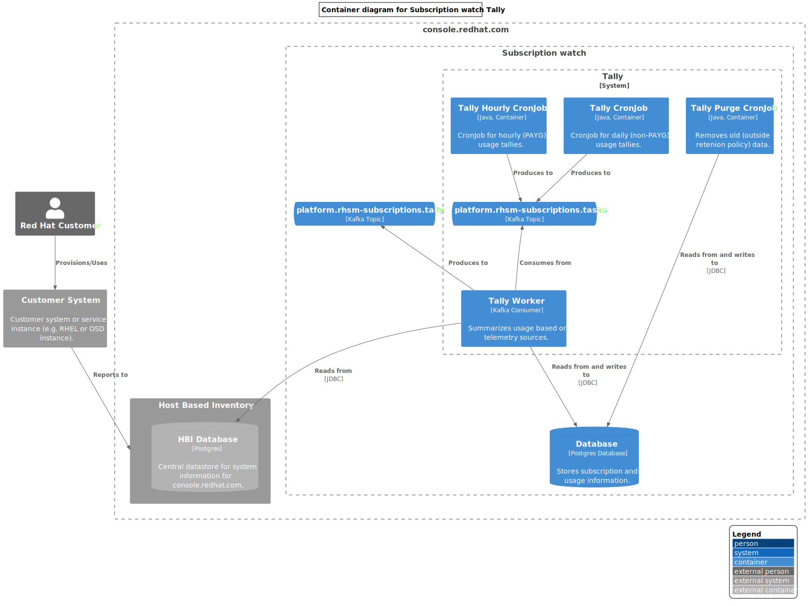

# Subscription watch

## Summary

Subscription watch can be thought of as several services that provide related functionality:

* [system-conduit](#system-conduit)
* [metrics ingress](#metrics-ingress)
* [tally](#tally)
* [subscription sync](#subscription-sync)
* [API/UI](#apiui)
* [billing usage notification](#billing-producers)

Also, see [networking diagrams](#networking-diagrams) to understand how requests are routed.

## System conduit

Service that syncs system data from Hosted Candlepin into HBI.

## Metrics Ingress

Services that sync system/instance telemetry data into Subscription watch.

## Tally

Service that tallies system usage based on telemetry data from various sources.

## Subscription Sync

Service that syncs subscription/offering data from RH IT services.

## API/UI

Customer facing views of the usage and capacity data.

## Billing Producers

Services that notify billing services of hourly usage.

## Networking diagrams

### Customer-facing API

### Internal API

