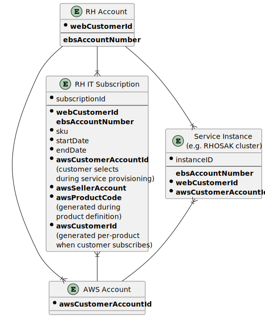
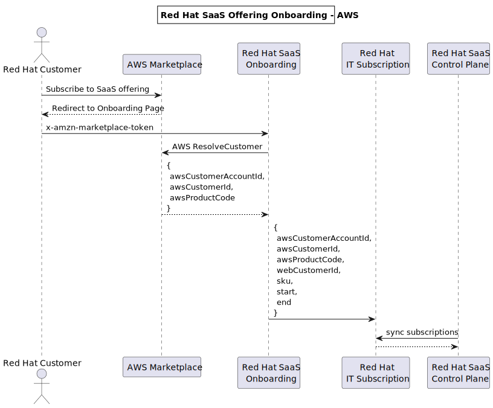
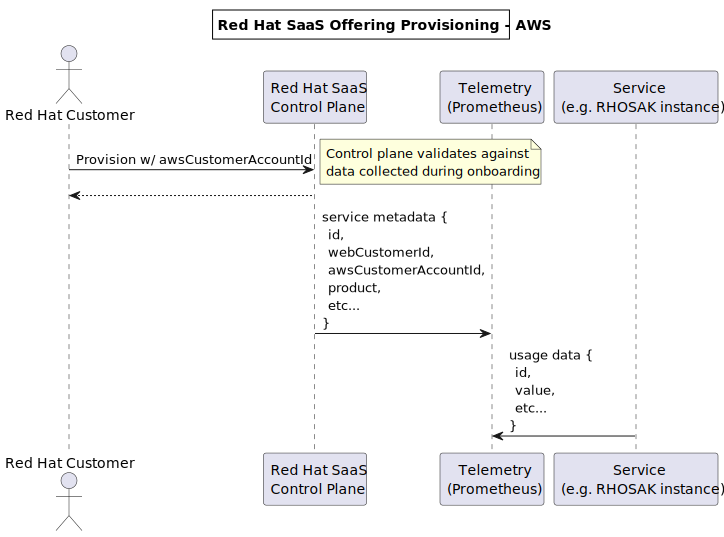

AWS Integration Notes
=====================

Accounts & Service Instances
----------------------------

Red Hat customers may have multiple AWS accounts. When a customer subscribes in AWS to a RH SaaS
offering, a record is created in the RH IT Subscription service, which is associated to a specific
AWS account.

During provisioning, a customer chooses which AWS account to bill against.

Sequence Diagrams
-----------------

The following occurs when a customer subscribes to a SaaS offering on AWS:

Then each time the customer provisions a new SaaS service instance:

When processing usage, subscription watch groups by "awsCustomerAccountId", and then looks up the
appropriate values to use for `awsProductCode` and `awsCustomerId` from the matching subscription
record. Subscription watch uses the value of `awsSellerAccount` to choose which AWS credentials to
use.
