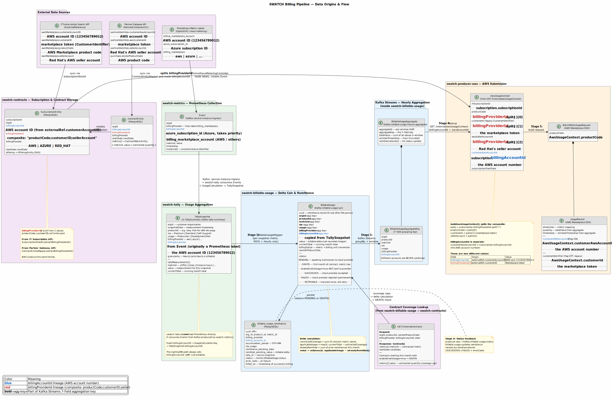

# Billing Pipeline Data Flow

This page documents the end-to-end flow of billable usage from **swatch-tally** through
**swatch-billable-usage** to **swatch-producer-aws** and the **AWS Marketplace Metering API**,
with emphasis on where each field originates and how the two key identifiers —
`billingAccountId` and `billingProviderId` — flow through the system.

Related issues: [SWATCH-5050](https://redhat.atlassian.net/browse/SWATCH-5050) (CustomerAWSAccountId),
[SWATCH-3651](https://redhat.atlassian.net/browse/SWATCH-3651) (Concurrent Agreements).

## Pipeline overview



```
Prometheus ──▶ swatch-metrics ──Kafka──▶ swatch-tally ──Kafka──▶ swatch-billable-usage ──Kafka──▶ Kafka Streams ──Kafka──▶ swatch-producer-aws ──HTTPS──▶ AWS Marketplace
               (Quarkus)                (Spring Boot)            (Quarkus)                        (inside billable-usage)   (Quarkus)                         Metering API
               reads labels,            consumes Events,              │                                                          │
               produces Events           aggregates snapshots         ├──▶ PostgreSQL (remittance tracking)                       ├──▶ swatch-contracts (AwsUsageContext)
                                                                     └──▶ swatch-contracts (contract coverage)                   └──◀ Kafka (status feedback)

IT Subscription API ──▶ swatch-contracts ──▶ SubscriptionEntity (billingAccountId + billingProviderId)
Partner Gateway API ──▶ swatch-contracts ──▶ ContractEntity → SubscriptionEntity
```

## The two key identifiers

Before diving into the flow stages, it's critical to understand two fields that look
similar but carry very different values:

| Field | What it holds | Example value | Origin |
|---|---|---|---|
| `billingAccountId` | The customer's **AWS account number** | `123456789012` | Prometheus label `billing_marketplace_account` (usage path) or `externalRef.customerAccountID` (contracts path) |
| `billingProviderId` | A **composite string** encoding three AWS Marketplace values | `AWSProductCode;cust-id-token;seller-acct` | Built from `externalRef.{productCode, customerID, sellerAccount}` |

### billingProviderId composite format (AWS)

`billingProviderId` is **not** a single identifier. For AWS, it's a semicolon-delimited
string of three values packed together:

```
String.format("%s;%s;%s",
    productCode,       // AWS Marketplace product code
    customerID,        // CustomerIdentifier (marketplace entitlement token)
    sellerAccount);    // Red Hat's AWS seller account ID
```

This is built in two places depending on the data source:

- **From IT Subscription Search API** (`SubscriptionDtoUtil.extractBillingProviderId`):
  reads `externalRef.awsMarketplace.{productCode, customerID, sellerAccount}`

- **From Partner Gateway API** (`ContractEntityMapper.extractBillingProviderId`):
  reads `partnerIdentities.{awsCustomerId, sellerAccountId}` + `purchase.vendorProductCode`

When `buildAwsUsageContext` runs in `ContractsResource`, it splits this back apart:

```java
String[] parts = subscription.getBillingProviderId().split(";");
String productCode    = parts[0];   // → AwsUsageContext.productCode
String customerId     = parts[1];   // → AwsUsageContext.customerId       (the marketplace token)
String sellerAccount  = parts[2];   // → AwsUsageContext.awsSellerAccountId
```

And separately reads the AWS account number:

```java
.customerAwsAccountId(subscription.getBillingAccountId())  // the AWS account number
```

So these two values that end up side-by-side in `AwsUsageContext` have different origins:

| AwsUsageContext field | Source field | What it is |
|---|---|---|
| `customerAwsAccountId` | `subscription.billingAccountId` | The AWS account number (`123456789012`) |
| `customerId` | `subscription.billingProviderId` parts[1] | The marketplace entitlement token (CustomerIdentifier) |

## Data flow stages

### Stage 1: Prometheus → swatch-metrics → swatch-tally → BillableUsage

Usage data originates from **Prometheus metric labels** set by OpenShift/cloud infrastructure
metering. **swatch-metrics** reads these labels and produces Events to Kafka.
**swatch-tally** consumes those Events, aggregates them into hourly `TallySnapshot`s,
and publishes a `TallySummary` to Kafka.

```
Prometheus labels                      swatch-metrics                    Kafka                          swatch-tally
  billing_marketplace_account  ──▶  PrometheusMeteringController  ──▶  service-instance-ingress  ──▶  EventController (persists)
  azure_subscription_id               creates Event with                                               MetricUsageCollector
  billing_marketplace                  billingAccountId                                                  ├─ Event.billingAccountId
                                                                                                        │   → UsageCalculation.Key
                                                                                                        └─ → TallySnapshot.billingAccountId
```

| Prometheus label | Event field | Meaning |
|---|---|---|
| `billing_marketplace_account` | `billingAccountId` | AWS account number (used unless Azure) |
| `azure_subscription_id` | `billingAccountId` | Azure subscription ID (takes priority over above) |
| `billing_marketplace` | `billingProvider` | `aws`, `azure`, etc. |

**Important**: swatch-tally does **not** read Prometheus directly — it consumes Events from
Kafka. The `billingAccountId` flows from the Event directly into `UsageCalculation.Key` and
then onto the `TallySnapshot`. It does **not** go through the Host/Instance table (the Host
stores it redundantly for display purposes only).

The **nightly/HBI tally path** always sets `billingAccountId = "_ANY"` and
`billingProvider = "_ANY"`, so HBI-sourced data never produces billable snapshots.

`BillableUsageMapper.toBillableUsage()` then creates one `BillableUsage` per snapshot metric.
Only PAYG-eligible, hourly-granularity snapshots with a specific (non-`_ANY`) `billingProvider`
and `billingAccountId` are processed.

| BillableUsage field | Copied from |
|---|---|
| `orgId` | `TallySummary.orgId` |
| `productId` | `TallySnapshot.productId` |
| `sla`, `usage` | `TallySnapshot.sla`, `TallySnapshot.usage` |
| `billingProvider` | `TallySnapshot.billingProvider` |
| `billingAccountId` | `TallySnapshot.billingAccountId` (originally from Prometheus via Event) |
| `metricId` | `TallyMeasurement.metricId` |
| `currentTotal` | `TallyMeasurement.currentTotal` (running month total) |

### Stage 2: Contract coverage lookup + delta calculation

**swatch-billable-usage** → **swatch-contracts** `GET /internal/contracts`

For contract-enabled products, billable-usage queries swatch-contracts for coverage caps:

```
Request: { orgId, productId, billingProvider, billingAccountId, snapshotDate }
Response: Contract[] with metrics[].value = contracted quantity
```

The delta calculation determines how much to actually bill:

```
contractedCoverage  = sum of contract metric values for matching contracts
applicableUsage     = max(0, currentTotal − contractedCoverage)
alreadyRemitted     = sum of prior remittances this month
value               = ceil(max(0, applicableUsage − alreadyRemitted))
```

### Status: GRATIS

A usage record is marked **GRATIS** (and **not sent** to the cloud provider) when both:

1. The metric has `enableGratisUsage = true` in swatch-product-configuration
2. **All** matching contracts started within the current month of the snapshot date

This covers the "first month free" scenario — usage is tracked for accounting but not billed.

### Stage 3: Persist remittance + Kafka Streams aggregation

Each `BillableUsage` is persisted to `billable_usage_remittance` with `status = PENDING`
(or `GRATIS`). Non-GRATIS records are emitted to Kafka.

Kafka Streams (running inside swatch-billable-usage) groups records by the **7-field
aggregation key** and windows them into hourly aggregates:

| # | Key field | Why it matters |
|---|---|---|
| 1 | `orgId` | Isolates billing per customer |
| 2 | `productId` | Different products billed separately |
| 3 | `metricId` | Different metrics billed separately |
| 4 | `sla` | Service level may affect pricing |
| 5 | `usage` | Production vs. Dev/Test may have different rates |
| 6 | `billingProvider` | Routes to the correct cloud marketplace |
| 7 | `billingAccountId` | The specific cloud account to bill — accounts are **never** combined |

The `BillableUsageAggregate` emitted per window contains:
- `totalValue` — sum of all `value` fields in the window
- `windowTimestamp` — hour-truncated window start
- `remittanceUuids[]` — for updating remittance records after submission

### Stage 4: AWS usage context lookup

**swatch-producer-aws** → **swatch-contracts** `GET /internal/awsUsageContext`

The producer looks up `AwsUsageContext` using `billingAccountId` from the aggregate key.
swatch-contracts finds the matching `SubscriptionEntity` and splits its `billingProviderId`
composite:

```
SubscriptionEntity.billingProviderId = "AWSProductCode;cust-token;seller-acct"
                                        ↓ split(";")
                    parts[0] = productCode        → AwsUsageContext.productCode
                    parts[1] = marketplace token   → AwsUsageContext.customerId
                    parts[2] = seller account      → AwsUsageContext.awsSellerAccountId

SubscriptionEntity.billingAccountId = "123456789012"
                                        ↓ direct copy
                    → AwsUsageContext.customerAwsAccountId
```

### Stage 5: Submit to AWS Marketplace

**swatch-producer-aws** → **AWS Marketplace** `BatchMeterUsage`

| AWS SDK field | Source | What it is |
|---|---|---|
| `productCode` | `AwsUsageContext.productCode` | AWS Marketplace product code |
| `UsageRecord.dimension` | metric-to-dimension mapping | The billing dimension |
| `UsageRecord.quantity` | `aggregate.totalValue` | Amount to bill |
| `UsageRecord.timestamp` | `aggregate.windowTimestamp` | Hour of usage |
| `UsageRecord.customerAWSAccountId` | `AwsUsageContext.customerAwsAccountId` | AWS account number (flag ON) |
| `UsageRecord.customerIdentifier` | `AwsUsageContext.customerId` | Marketplace token (flag OFF, legacy) |

`awsSellerAccountId` determines which AWS credentials are used to authenticate the API call.

### Stage 6: Status feedback

**swatch-producer-aws** → Kafka `billable-usage-status` → **swatch-billable-usage** → PostgreSQL

After each AWS call, the producer emits the aggregate's `remittanceUuids` with a status.
swatch-billable-usage updates the matching `billable_usage_remittance` records.

### BillableUsage status values

| Status | Meaning | Sent to provider? |
|---|---|---|
| `PENDING` | Awaiting submission to cloud marketplace | Not yet |
| `GRATIS` | First month of contract + metric has `enableGratisUsage=true` | **No** — tracked but not billed |
| `SUCCEEDED` | Cloud provider accepted the usage record | Yes, done |
| `FAILED` | Cloud provider rejected permanently | Yes, failed |
| `RETRYABLE` | Transient error (rate limit, timeout) — will retry | Yes, will retry |

## Field lineage: billingAccountId (AWS account number)

```
Prometheus label: billing_marketplace_account = "123456789012"
    │
    ▼  (PrometheusMeteringController in swatch-metrics)
Event.billingAccountId
    │
    ▼  (Kafka: service-instance-ingress → swatch-tally consumes)
    │  (Event → UsageCalculation.Key → TallySnapshot)
TallySnapshot.billingAccountId
    │
    ▼  (BillableUsageMapper, Stage 1)
BillableUsage.billingAccountId                         ← part of the 7-field aggregation key
    │
    ├──▶ billable_usage_remittance.billing_account_id  ← persisted to DB
    │
    ▼  (Kafka Streams groupBy, Stage 3)
BillableUsageAggregateKey.billingAccountId             ← ensures different accounts never merge
    │
    ▼  (GET /internal/awsUsageContext?awsAccountId=..., Stage 4)
AwsUsageContext.customerAwsAccountId                   ← from subscription.billingAccountId
    │
    ▼  (BatchMeterUsage, Stage 5)
UsageRecord.customerAWSAccountId                       ← sent to AWS (when flag ON)
```

## Field lineage: billingProviderId (composite string)

```
IT Subscription API:                    Partner Gateway API:
  externalRef.awsMarketplace              partnerIdentities + purchase
    .productCode                            .vendorProductCode
    .customerID                             .awsCustomerId
    .sellerAccount                          .sellerAccountId
         │                                        │
         ▼                                        ▼
    SubscriptionDtoUtil                  ContractEntityMapper
    .extractBillingProviderId()          .extractBillingProviderId()
         │                                        │
         └──────────────┬─────────────────────────┘
                        ▼
    SubscriptionEntity.billingProviderId = "productCode;customerID;sellerAccount"
                        │
                        ▼  (ContractsResource.buildAwsUsageContext)
                    split(";")
                        │
        ┌───────────────┼───────────────┐
        ▼               ▼               ▼
    parts[0]        parts[1]        parts[2]
    productCode     customerID      sellerAccount
        │               │               │
        ▼               ▼               ▼
    AwsUsageContext  AwsUsageContext  AwsUsageContext
    .productCode    .customerId     .awsSellerAccountId
        │               │               │
        ▼               ▼               ▼
    BatchMeterReq   UsageRecord     (selects AWS
    .productCode    .customerIdentifier  credentials)
                    (legacy, flag OFF)
```

## SWATCH-5050: CustomerAWSAccountId migration

AWS is deprecating `CustomerIdentifier` (the marketplace token from `billingProviderId[1]`)
in favour of `CustomerAWSAccountId` (the account number from `billingAccountId`) to support
[License Delegation](https://redhat.atlassian.net/browse/SWATCH-5050) and, later,
[Concurrent Agreements](https://redhat.atlassian.net/browse/SWATCH-3651).

| Flag | `UsageRecord` field | Value source |
|---|---|---|
| `use-customer-aws-account-id` = **OFF** (default) | `customerIdentifier` | `AwsUsageContext.customerId` (marketplace token) |
| `use-customer-aws-account-id` = **ON** | `customerAWSAccountId` | `AwsUsageContext.customerAwsAccountId` (AWS account number) |

Falls back to `customerIdentifier` if `customerAwsAccountId` is null.

`productCode` continues to be sent; it is removed in a later phase (SWATCH-3651) when
`LicenseARN` support is added.

## Key source files

| File | Role |
|---|---|
| `swatch-metrics/.../PrometheusMeteringController.java` | Reads Prometheus labels, creates Events with billingAccountId |
| `swatch-metrics/.../MeteringEventFactory.java` | Builds Event objects from Prometheus data |
| `swatch-contracts/.../SubscriptionDtoUtil.java` | Builds `billingProviderId` composite from IT Subscription API |
| `swatch-contracts/.../ContractEntityMapper.java` | Builds `billingProviderId` composite from Partner Gateway API |
| `swatch-contracts/.../SubscriptionEntity.java` | Stores `billingAccountId` + `billingProviderId` |
| `swatch-contracts/.../ContractsResource.java` | `buildAwsUsageContext()` — splits the composite string |
| `swatch-billable-usage/.../BillableUsageMapper.java` | TallySummary → BillableUsage mapping |
| `swatch-billable-usage/.../BillableUsageService.java` | Delta calculation + remittance persist |
| `swatch-billable-usage/.../ContractsController.java` | Contract coverage lookup + GRATIS logic |
| `swatch-billable-usage/.../StreamTopologyProducer.java` | Kafka Streams aggregation topology |
| `swatch-model-billable-usage/.../BillableUsageAggregateKey.java` | 7-field aggregation key |
| `swatch-producer-aws/.../AwsBillableUsageAggregateConsumer.java` | AWS context lookup + submission |
