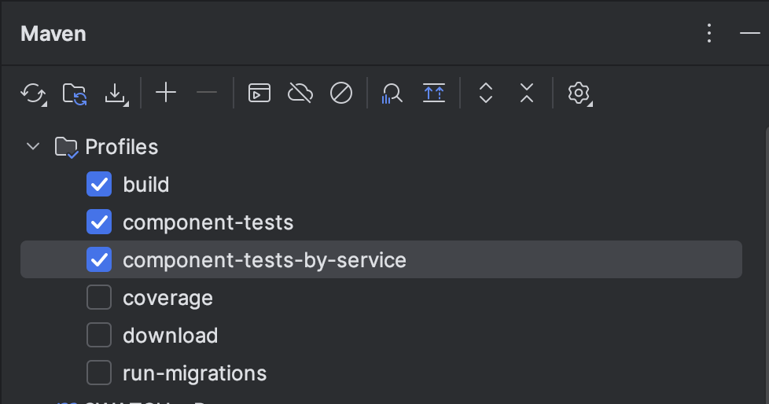

# Component Tests

This document provides instructions for running component tests for SWATCH services. Component tests can be executed in two environments: locally using containers, or against a deployed Bonfire environment in OpenShift.

## Prerequisites

Before running component tests, ensure you have the following dependencies installed from the project root:

```bash
./mvnw clean install -DskipTests
```

Also, if you want to run the tests using IntelliJ, ensure you have enabled the Maven profiles: 
- `component-tests` 
- `component-tests-openshift`

And sync up the projects. 



## Running Tests Locally

### 1. Start Local Dependencies

Start the required local services using Docker Compose:

```bash
podman compose up -d
```

This will start all necessary dependencies (databases, Kafka, etc.) required for the component tests.

### 2. Run Component Tests

Execute tests for a specific service. For example, to run tests for `swatch-producer-azure`:

```bash
./mvnw clean install -Pcomponent-tests -Dservice=swatch-producer-azure
```

Replace `swatch-producer-azure` with the specific service you want to test.

## Running Tests Against OpenShift (Bonfire)

### 1. Deploy Dependencies in OpenShift

You have two deployment options:

#### Option A: Deploy All SWATCH Services

Deploy the complete SWATCH environment:

```bash
bonfire deploy rhsm --timeout 1800 --no-remove-resources app:rhsm --no-remove-resources app:export-service --source=appsre --ref-env insights-stage -d 24h
```

#### Option B: Deploy Minimal Dependencies for Specific Service

Deploy only the necessary dependencies for a specific service. For example, for `swatch-producer-azure` (which only requires wiremock and kafka bridge, as Kafka comes by default):

```bash
bonfire deploy rhsm --source=appsre --ref-env insights-stage --component swatch-producer-azure --remove-dependencies swatch-producer-azure --component wiremock --component swatch-kafka-bridge
```

### 2. Run Component Tests Against OpenShift

Execute tests for a specific service against the OpenShift environment. For example, to run tests for `swatch-producer-azure`:

```bash
./mvnw clean install -Pcomponent-tests -Dservice=swatch-producer-azure -Dswatch.component-tests.global.target=openshift
```

The key difference is the addition of the `-Dswatch.component-tests.global.target=openshift` parameter, which tells the test framework to target the OpenShift deployment instead of local containers.

## Configuration

The component tests can be configured using system properties:

- `swatch.component-tests.global.target`: Set to `openshift` to run against OpenShift deployment, or omit for local execution
- Additional configuration options may be available per service

