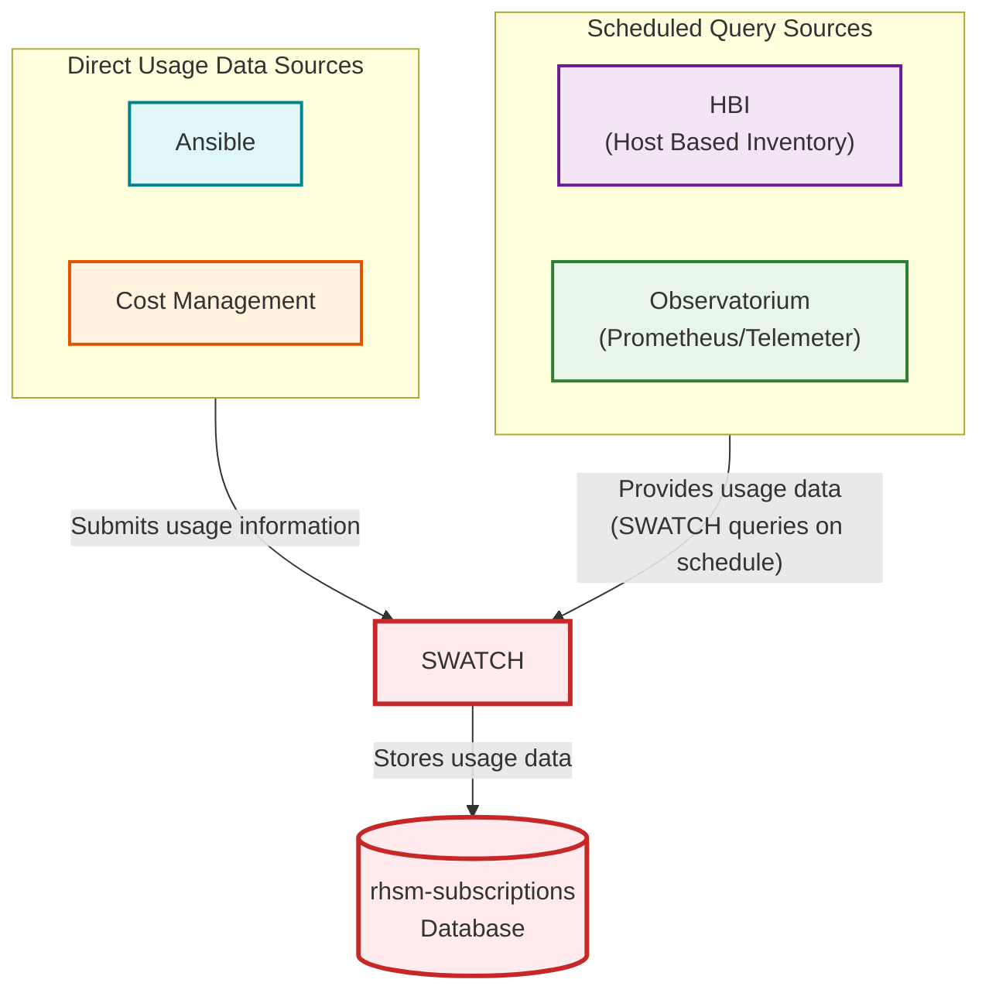
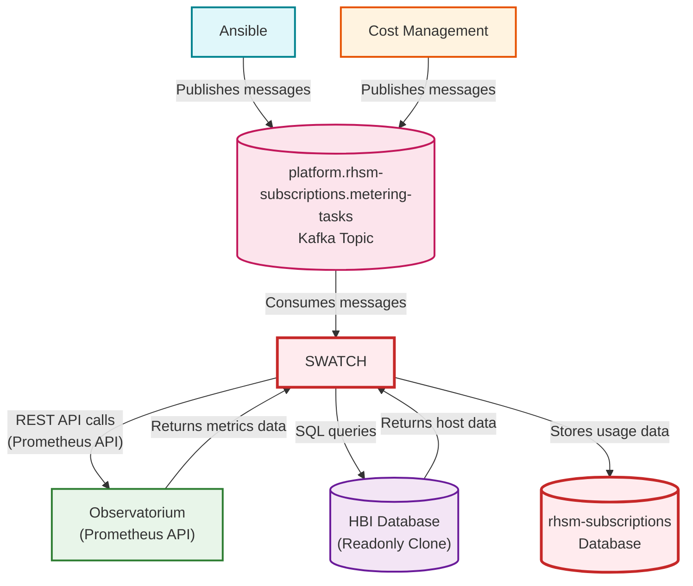
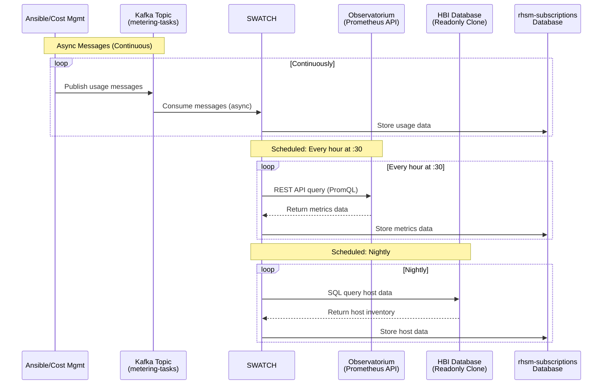
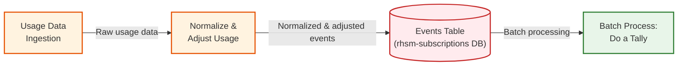

# SWATCH Data Sources - Instance and Usage Information

## Data Flow Summary

### 1. Direct Usage Submissions
- **Ansible** and **Cost Management** submit usage information messages directly to SWATCH
- These systems send actual usage data that SWATCH processes and aggregates

### 2. Scheduled Queries

#### HBI (Host Based Inventory)
- **SWATCH queries HBI** on a scheduled basis to:
  - Get host/instance information
  - Retrieve host metadata and relationships

#### Observatorium (Prometheus/Telemeter)
- **SWATCH queries Observatorium** on a scheduled basis to fetch:
  - OpenShift cluster metrics (via Telemeter)
  - RHEL telemetry metrics (via Rhelemeter)
  - Time-series usage data for various products

### 3. Data Storage
- **SWATCH stores all usage data** in the `rhsm-subscriptions` database
- This includes usage information from all sources (Ansible, Cost Management, HBI, and Observatorium)

---

## Technical Implementation Details

### Technical Details

#### 1. Kafka Integration
- **Ansible** and **Cost Management** publish usage messages to the Kafka topic `platform.rhsm-subscriptions.metering-tasks`
- **SWATCH** consumes messages from this topic to process usage data

#### 2. Observatorium Integration
- **SWATCH** makes **REST API calls** to Observatorium using the Prometheus API
- Queries use PromQL (Prometheus Query Language) to fetch metrics
- Returns time-series usage data for processing

#### 3. HBI Database Integration
- **SWATCH** queries a **readonly clone** of the HBI database using SQL
- This provides direct access to host inventory data without impacting the primary HBI database
- Returns host/instance information and metadata

---

## Timing and Scheduling Patterns

### Scheduling Details

- **Kafka Messages**: Processed **asynchronously** as they arrive from Ansible/Cost Management
- **Observatorium Queries**: Executed **every hour at the 30-minute mark** (e.g., 1:30, 2:30, 3:30)
- **HBI Database Queries**: Executed **nightly** during scheduled maintenance window

---

## Post-Ingestion Processing Flow

### Processing Pipeline

1. **Usage Ingestion**
   - Raw usage data is received from all sources (Ansible, Cost Management, HBI, Observatorium)

2. **Normalization & Adjustment**
   - Usage values are **normalized** according to product-specific rules
   - Usage may be **adjusted or amended** based on business logic (e.g., hypervisor relationships, guest mappings)
   - Metadata is enriched (e.g., display names, relationships)

3. **Events Table (Staging Area)**
   - Normalized and adjusted events are persisted to the **Events table** in the `rhsm-subscriptions` database
   - This table serves as a **staging area** where events accumulate before batch processing
   - Events remain in this table until the tally process consumes them

4. **Batch Tally Process**
   - A scheduled batch process ("do a tally") reads events from the Events table
   - Events are aggregated by organization, product, metric, and time period
   - Aggregated tallies are stored in snapshot tables for reporting and billing

