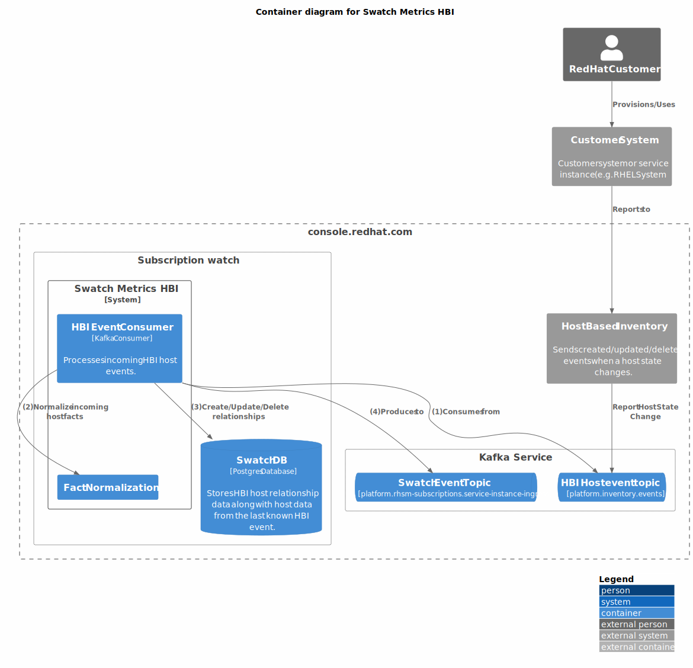

# swatch-metrics-hbi

swatch-metrics-hbi is a service deployed within the Subscription Watch ecosystem that
translates HBI host events into SWatch host events and puts them on the SWatch Event
topic for consumption by the tally service.

An incoming HBI event contains host facts that will be normalized into relevant host data that is used by
the tally service when creating hosts and tallying usage. In order to avoid bloating outgoing SWatch events,
it should only contain the required data needed by the tally service to create/update a host, and applicable
measurements to tally.

An outgoing SWatch event will contain:
  - Only relevant Host metadata (inventory_id, instance_id, subscription_manager_id, display_name, ...)
  - All applicable measurements which are pre-calculated based on facts provided by HBI, and should 
    represent the values that will be tallied by the tally service.
 
In short, once a SWatch event is sent, its data should not require any further 'normalization' by the tally
service.

## Component/Flow Diagram


### HBI Event Consumer
The HBI Event Consumer is the main entry point into this service. It is a Kafka consumer that
consumes event messages from the HBI event topic (platform.inventory.events). HBI emits host events
whenever a host is created, updated, or deleted, from its inventory.

#### Created/Updated Event Handling
When a created/updated event message is received:
1. The HBI host facts are normalized into standard host metadata and measurements that the tally
   service can process.
2. A relationship record is created/updated.
3. A SWatch event message (INSTANCE_CREATED/INSTANCE_UPDATED) is created from the normalized
   facts/measurements and sent to the SWatch host ingress kafka topic
   (platform.rhsm-subscriptions.service-instance-ingress) to be ingested by the tally service.
4. If the incoming HBI host event has an impact on another already known host
   (via its relationship), additional SWatch events are sent for the affected hosts, containing
   re-normalized facts/measurements based on the incoming HBI event that triggered the change.
   For example, a RHEL guest transitioning from unmapped to mapped, when its hypervisor becomes known.

#### Delete Event Handling
When a delete event message is received:
1. The relationship for the host is removed from the DB.
2. A SWatch event is sent with type INSTANCE_DELETED (not currently handled by host ingestion).
3. A SWatch event is sent with type INSTANCE_UPDATED with re-normalized facts/measurements for
   any known host that will be impacted by the deletion of the host. For example, a RHEL guest transitioning
   from mapped to unmapped, when its hypervisor is deleted.

### Fact Normalization
HBI fact normalization functions exactly as it does in the monolith during nightly tally.

**NOTE:** Because fact normalization is so tightly coupled to the nightly tally hypervisor/guest
mapping logic, we are temporarily duplicating this logic across services. This duplication will be
removed once the event based nightly tally process is implemented.

### Relationship Tracking
The presence of a hbi_host_relationship record indicates that a host is known to be in HBI and that
it has been seen before.

A relationship record contains the following data:
* **inventory_id**:
  * Allows mapping an incoming HBI event to a relationship record.
* **org_id**:
  * Allows mapping an incoming HBI event to a relationship record.
* **subscription_manager_id**:
  * Used to identify a hypervisor based on a guest's hypervisor_uuid.
* **hypervisor_uuid**:
  * Used to map an incoming host to an existing hypervisor's relationship record via
    subscription_manager_id.
* **is_unmapped_guest**:
  * Tracks whether the host is known to be unmapped (its hypervisor is not known).
  * Allows for identifying guests that are currently unmapped.
  * Used to identify the guests that require an update event when their hypervisor is reported/deleted.
* **creation_date**:
  * Marks when a record was first created.
* **last_updated**:
  * Marks when a record was last updated.
* **latest_hbi_event_data**:
  * Contains the host data from the last HBI event that was received (JSON).
  * Used when re-normalizing host facts/measurements when an incoming event for another host impacts
    the current facts/measurements of the host represented by this record.

### Outgoing SWatch Events
An outgoing SWatch event will have a service_type of HBI_HOST and an event_type of either INSTANCE_CREATED,
INSTANCE_UPDATED or INSTANCE_DELETED. The event will only include the data required by the tally
process to update the corresponding host's metadata and measurements, and should never require further
normalization during the tally process. An event's timestamp will be truncated to the hour of that of the
incoming HBI event so that conflict resolution will take effect on event ingestion.

# Quarkus
This project uses Quarkus, the Supersonic Subatomic Java Framework.

If you want to learn more about Quarkus, please visit its website: https://quarkus.io/ .

## Running the application in dev mode

You can run your application in dev mode that enables live coding using:

```shell script
./mvnw quarkus:dev
```

> **_NOTE:_**  Quarkus now ships with a Dev UI, which is available in dev mode only
> at http://localhost:8080/q/dev/.

## Packaging and running the application

The application can be packaged using:

```shell script
./mvnw clean install
```

It produces the `quarkus-run.jar` file in the `build/quarkus-app/` directory.
Be aware that it’s not an _über-jar_ as the dependencies are copied into
the `build/quarkus-app/lib/` directory.

The application is now runnable using `java -jar build/quarkus-app/quarkus-run.jar`.

If you want to build an _über-jar_, execute the following command:

```shell script
./mvnw clean install -Dquarkus.package.type=uber-jar
```

The application, packaged as an _über-jar_, is now runnable using `java -jar build/*-runner.jar`.

## Creating a native executable

You can create a native executable using:

```shell script
./mvnw clean install -Dquarkus.package.type=native
```

Or, if you don't have GraalVM installed, you can run the native executable build in a container
using:

```shell script
./mvnw clean install -Dquarkus.package.type=native -Dquarkus.native.container-build=true
```

You can then execute your native executable with: `./build/swatch-billable-usage-1.0-SNAPSHOT-runner`

If you want to learn more about building native executables, please
consult https://quarkus.io/guides/gradle-tooling.

## Related Guides

- SmallRye Reactive Messaging ([guide](https://quarkus.io/guides/reactive-messaging)): Produce and
  consume messages and implement event driven and data streaming applications
- SmallRye Reactive Messaging - Kafka
  Connector ([guide](https://quarkus.io/guides/kafka-reactive-getting-started)): Connect to Kafka
  with Reactive Messaging
- YAML Configuration ([guide](https://quarkus.io/guides/config#yaml)): Use YAML to configure your
  Quarkus application

## Provided Code

### YAML Config

Configure your application with YAML

[Related guide section...](https://quarkus.io/guides/config-reference#configuration-examples)

The Quarkus application configuration is located in `src/main/resources/application.yml`.

### Reactive Messaging codestart

Use SmallRye Reactive Messaging

[Related Apache Kafka guide section...](https://quarkus.io/guides/kafka-reactive-getting-started)

### RESTEasy Reactive

Easily start your Reactive RESTful Web Services

[Related guide section...](https://quarkus.io/guides/getting-started-reactive#reactive-jax-rs-resources)
