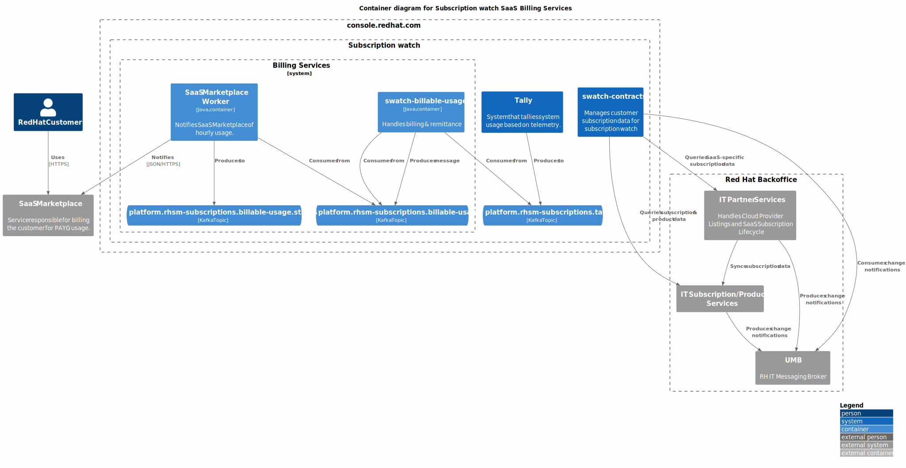

# swatch-producer-aws

swatch-producer-aws is a service deployed within the Subscription Watch ecosystem that sends
billable usage data to AWS Marketplace for customer billing. The service acts as a bridge between
the SWATCH billing system and AWS Marketplace Metering Service, consuming billable usage aggregates
and submitting them to AWS for metering and billing purposes.

The service receives billable usage aggregates from the swatch-billable-usage service via Kafka,
enriches them with AWS-specific context information from swatch-contracts, and submits the usage
records to AWS Marketplace using the AWS Marketplace Metering API. It handles AWS-specific
requirements such as usage record formatting, credential management, batch submission, and error
handling for throttling and retries.

An incoming billable usage aggregate contains aggregated usage data for a specific organization,
product, metric, and time window. The service processes this data to create AWS usage records that
comply with AWS Marketplace requirements and submits them for billing.

An outgoing usage status message will contain:
  - The UUID of the original billable usage record
  - The status (SUCCESS or FAILED)
  - Error details if the submission failed
  - Timestamp of when the status was determined

In short, swatch-producer-aws is responsible for translating SWATCH billable usage data into
AWS-specific metering records and ensuring they are successfully submitted to AWS Marketplace,
while providing status feedback to swatch-billable-usage for tracking and reconciliation.

## Component/Flow Diagram

### AWS Billable Usage Aggregate Consumer
The AWS Billable Usage Aggregate Consumer is the main entry point into this service. It is a Kafka
consumer that consumes billable usage aggregate messages from the hourly aggregate topic
(platform.rhsm-subscriptions.billable-usage-hourly-aggregate). These aggregates are produced by
the swatch-billable-usage service after aggregating usage data into hourly windows.

#### Billable Usage Aggregate Processing
When a billable usage aggregate is received:
1. The service validates that the aggregate is for AWS billing provider.
2. It queries the swatch-contracts service to retrieve AWS usage context, which includes:
   - AWS customer ID (from the customer's AWS account)
   - AWS product code (the vendor product code registered in AWS Marketplace)
   - Subscription information for mapping to AWS dimensions
3. The service validates the usage timestamp is within the acceptable AWS usage window (typically
   no older than a configured threshold to prevent rejected submissions).
4. The aggregate is converted into AWS UsageRecord format:
   - Timestamp is set to the aggregate window time
   - Dimension name is derived from the metric ID
   - Quantity is the aggregated usage value
   - Customer identifier is the AWS customer ID
5. Usage records are batched (up to 25 records per batch as per AWS limits) and submitted to the
   AWS Marketplace Metering API using `BatchMeterUsage`.
6. The service processes the AWS response:
   - For successful submissions: produces a SUCCESS status message to the billable usage status topic
   - For rejected records: logs the error and produces a FAILED status message with error details
   - For throttling errors: implements exponential backoff retry logic
   - For unprocessed records: retries submission or reports failure after exhausting retries

### AWS Marketplace Metering Integration
The service integrates with the AWS Marketplace Metering Service API to submit usage records. Key
aspects of this integration:
- **Credentials Management**: AWS credentials are managed per product code and stored securely.
  The service uses AWS SDK's credentials provider chain to authenticate with AWS.
- **Batch Submission**: Multiple usage records are batched together for efficiency, respecting
  AWS's limit of 25 records per batch.
- **Throttling Handling**: AWS Marketplace has rate limits. The service implements exponential
  backoff and retry logic to handle throttling exceptions gracefully.
- **Dry Run Mode**: The service supports a dry run mode (ENABLE_AWS_DRY_RUN) for testing without
  actually submitting usage to AWS Marketplace.

### AWS Usage Context Lookup
Before submitting usage to AWS, the service must determine the AWS-specific identifiers. It queries
the swatch-contracts service API endpoint to retrieve:
- **AWS Customer ID**: The customer's AWS account ID that made the marketplace purchase
- **Product Code**: The AWS Marketplace product code for the specific offering
- **Subscription Details**: Information linking the SWATCH subscription to the AWS marketplace listing

This context lookup ensures that usage is properly attributed to the correct customer and product
in AWS Marketplace.

### Usage Record Validation
The service performs several validations before submitting usage to AWS:
- **Timestamp Validation**: Ensures the usage timestamp is within the acceptable window
  (AWS_MARKETPLACE_USAGE_WINDOW). Usage records that are too old will be rejected by AWS.
- **Credential Validation**: Verifies that AWS credentials are available for the product code.
- **Subscription Status**: Checks that the subscription has not been recently terminated, as AWS
  will reject usage for terminated subscriptions.
- **Dimension Mapping**: Validates that the metric ID can be mapped to a valid AWS dimension.

### Status Reporting
After processing each usage aggregate, the service produces status messages to the billable usage
status topic (platform.rhsm-subscriptions.billable-usage.status). These status messages inform
swatch-billable-usage whether the usage was successfully billed:
- **SUCCESS**: Usage was accepted by AWS Marketplace and will be billed to the customer
- **FAILED**: Usage submission failed due to errors (throttling, invalid credentials, subscription
  issues, etc.)

Status messages include the original billable usage UUID for correlation and error details to aid
in troubleshooting.

### Error Handling and Retry Logic
The service implements comprehensive error handling:
- **Throttling**: Automatic retry with exponential backoff for AWS throttling exceptions
- **Transient Errors**: Retry logic for temporary AWS API failures
- **Permanent Errors**: Immediate failure reporting for errors that won't succeed on retry
  (expired credentials, subscription terminated, timestamp out of bounds)
- **Unprocessed Records**: AWS may return some records as unprocessed; the service attempts to
  resubmit these records

### Monitoring and Metrics
The service exposes several metrics for monitoring:
- `swatch_aws_marketplace_batch_accepted_total`: Count of usage records accepted by AWS
- `swatch_aws_marketplace_batch_rejected_total`: Count of usage records rejected by AWS
- `swatch_aws_marketplace_batch_ignored_total`: Count of usage records ignored (dry run, validation failures)
- `swatch_producer_metered_total`: Total usage metered by product, metric, and billing provider
