# EventConflictType & Event Transformation (Updated)

This document contains visual Mermaid diagrams showing how incoming events are transformed based on their conflict types in the RHSM Subscriptions system, including the recent batch processing optimizations and cascading deductions fix.

# EventConflictType Mermaid Diagrams

## Overview of EventConflictTypes

The system defines 5 different types of event conflicts that can occur during event processing:

1. **ORIGINAL** - First occurrence of an event
2. **IDENTICAL** - Duplicate event (ignored)
3. **CORRECTIVE** - Same descriptors, different measurements
4. **CONTEXTUAL** - Same measurements, different descriptors  
5. **COMPREHENSIVE** - Different measurements and descriptors

## Batch Processing Overview

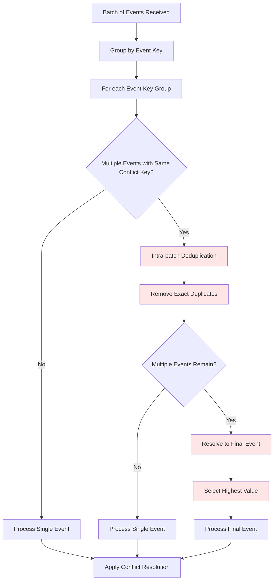

## Updated Event Processing Flow

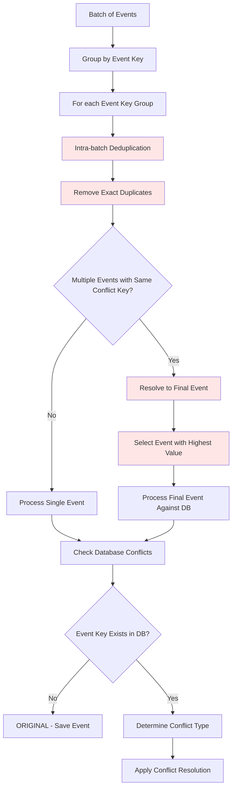

## 1. ORIGINAL Event Flow (Updated)

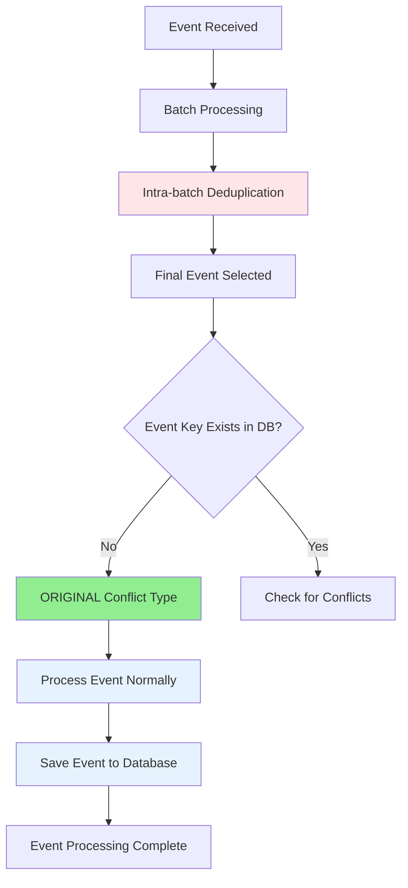

## 2. IDENTICAL Event Flow (Updated)

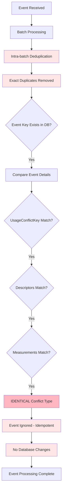

## 3. CORRECTIVE Event Flow (Updated - Batch Processing)

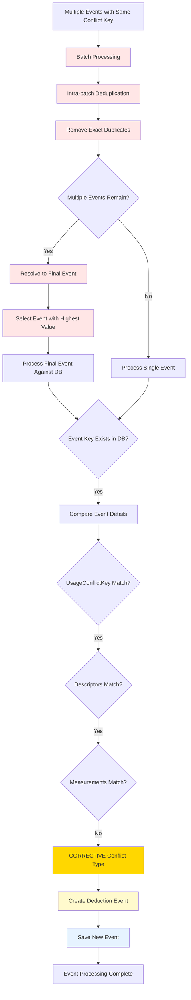

## 4. CONTEXTUAL Event Flow (Updated)

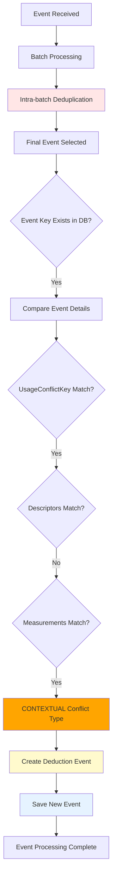

## 5. COMPREHENSIVE Event Flow (Updated)

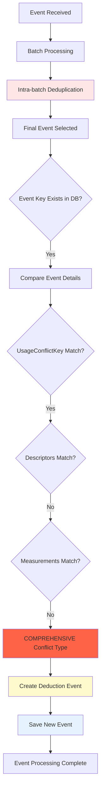

## Complete Decision Tree (Updated)

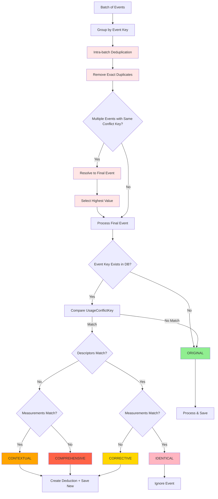

## Cascading Deductions Fix - Before vs After

### Before Fix (Individual Processing)

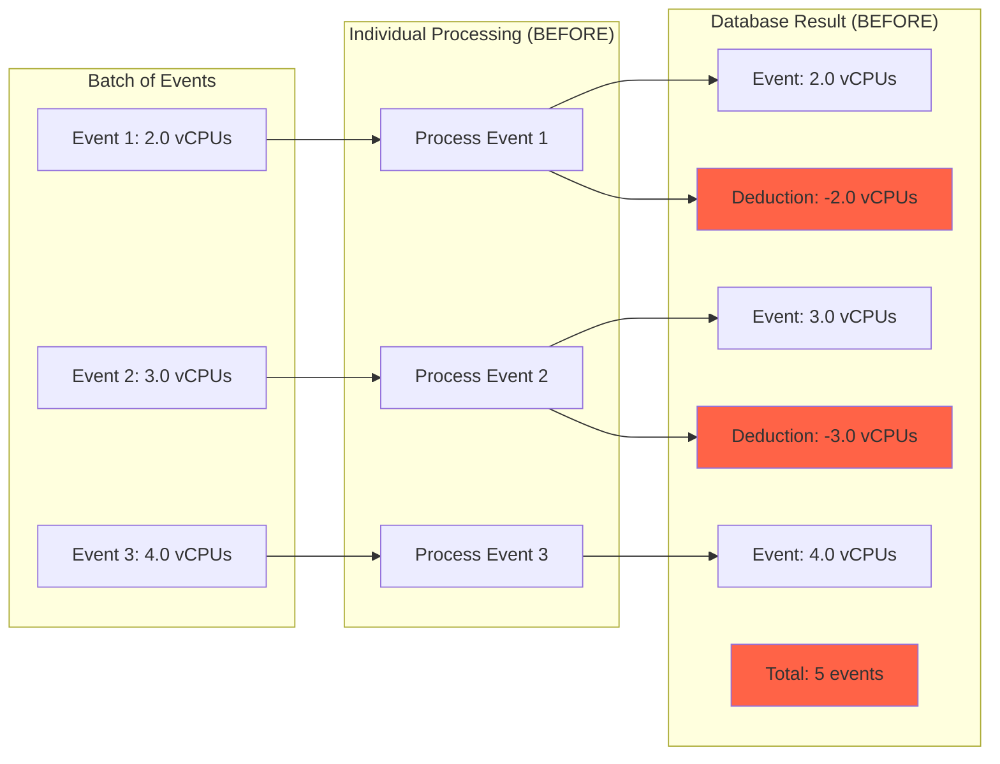

### After Fix (Batch Processing)

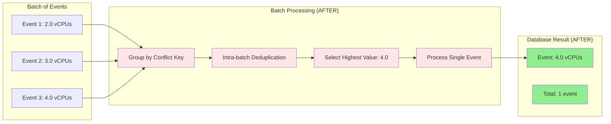

## Conflict Type Summary Table (Updated)

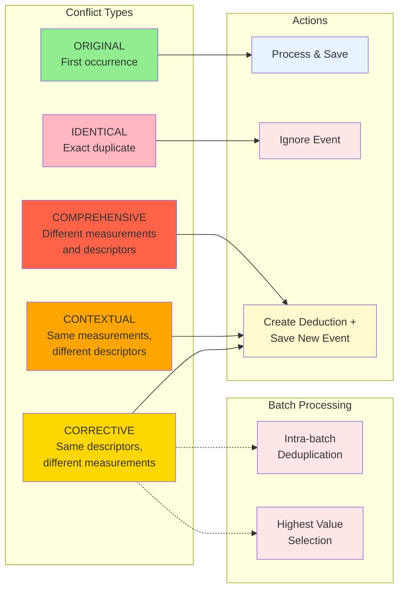

## Key Methods Behavior (Updated)

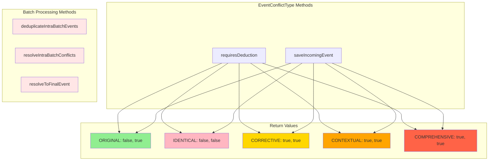

## Event Processing State Machine (Updated)

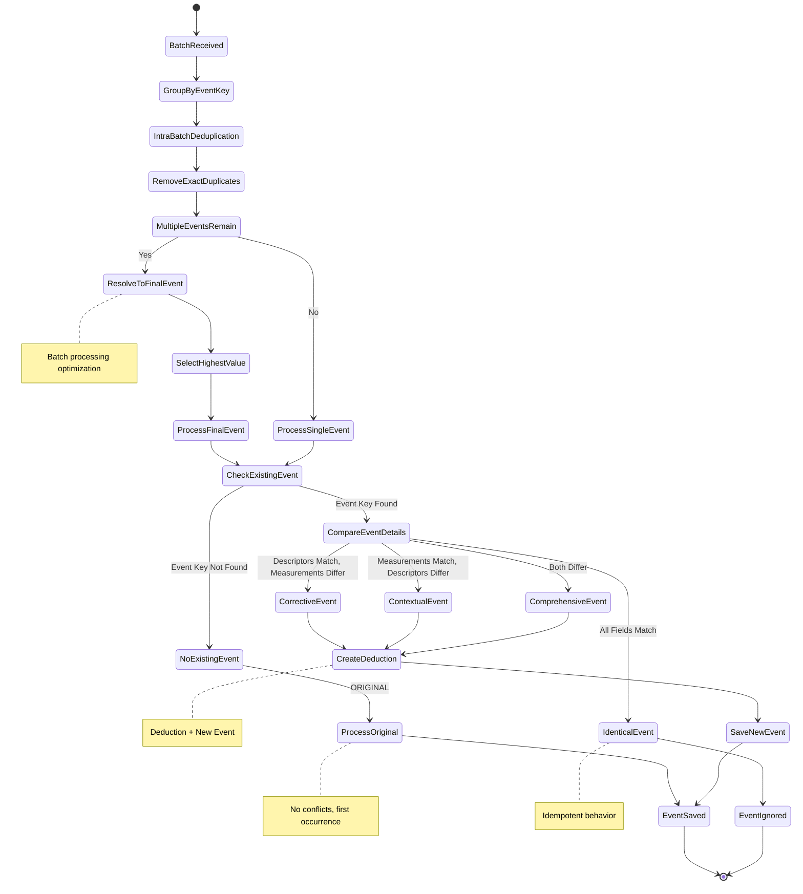

## Visual Event Transformation Diagrams (Updated)

### 1. ORIGINAL Event - No Transformation (Updated)

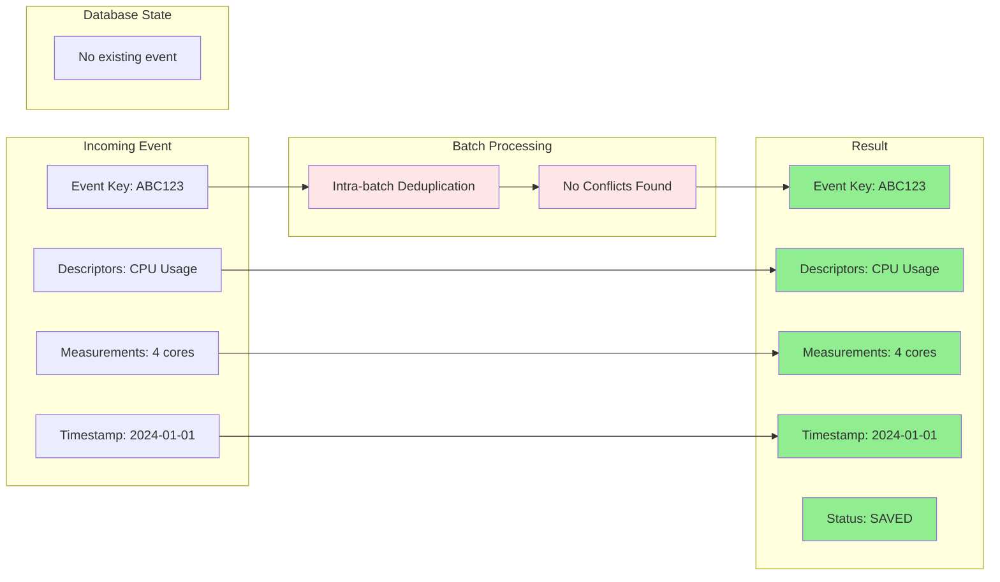

### 2. IDENTICAL Event - Ignored (Updated)

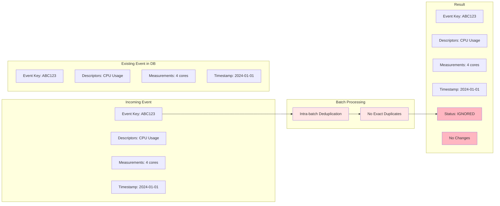

### 3. CORRECTIVE Event - Batch Processing (Updated)

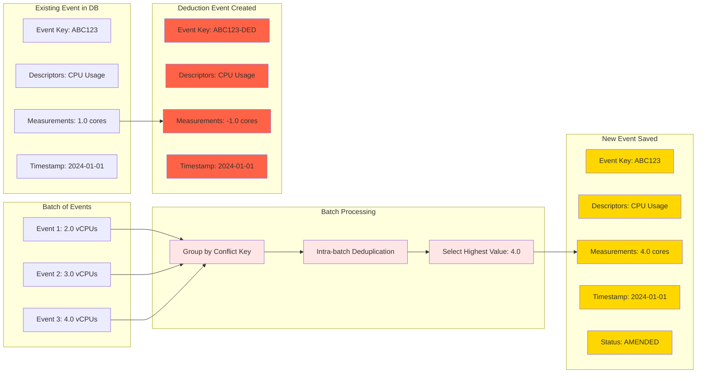

### 4. CONTEXTUAL Event - Descriptor Amendment (Updated)

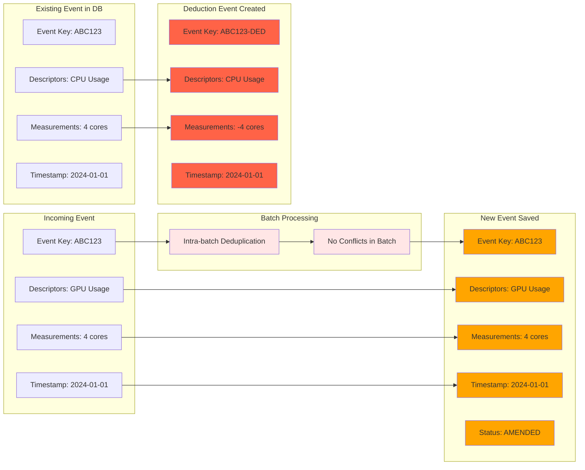

### 5. COMPREHENSIVE Event - Full Amendment (Updated)

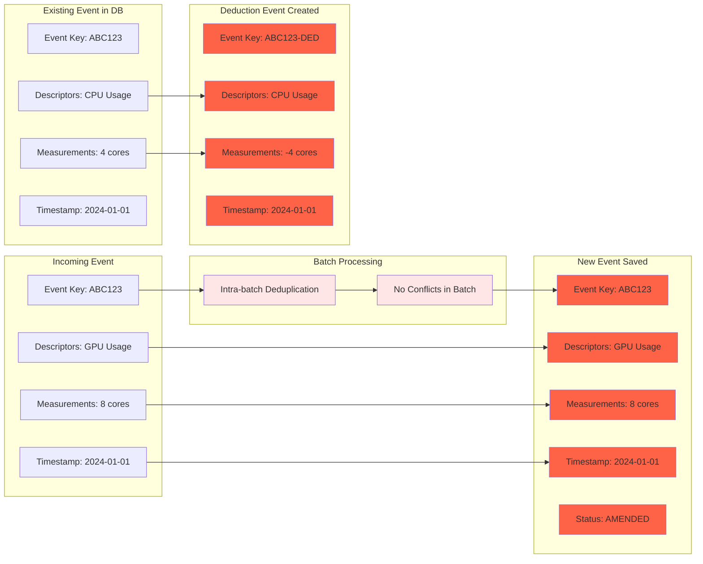

## Event Transformation Summary (Updated)

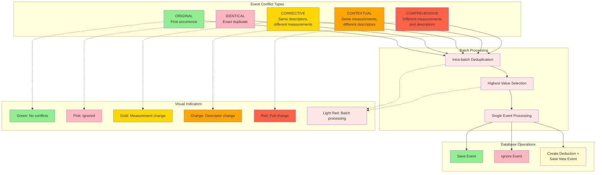

## Data Flow Visualization (Updated)

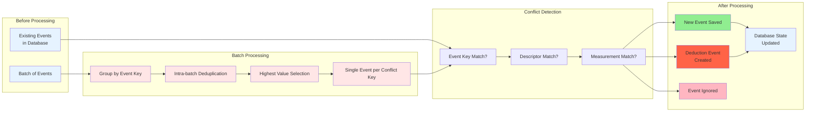

## Color Legend (Updated)

- **🟢 Green (#90EE90)**: ORIGINAL events - no conflicts, processed normally
- **🩷 Pink (#FFB6C1)**: IDENTICAL events - ignored, no changes
- **🟡 Gold (#FFD700)**: CORRECTIVE events - measurement changes
- **🟠 Orange (#FFA500)**: CONTEXTUAL events - descriptor changes  
- **🔴 Red (#FF6347)**: COMPREHENSIVE events - full changes and deduction events
- **🔵 Blue (#E6F3FF)**: Neutral/process elements
- **🟡 Light Yellow (#FFFACD)**: Deduction-related operations
- **🟥 Light Red (#FFE6E6)**: Batch processing operations (NEW)

## Key Changes Summary

### What's New:
1. **Batch Processing**: Events are now processed in batches, not individually
2. **Intra-batch Deduplication**: Exact duplicates are removed within a batch
3. **Highest Value Selection**: When multiple events have the same conflict key, only the highest value is processed
4. **Cascading Deductions Prevention**: No more incorrect deduction chains

### What's Improved:
1. **Performance**: Reduced database operations by processing events together
2. **Data Integrity**: Eliminated cascading deductions bug
3. **Consistency**: Predictable "highest value wins" behavior
4. **Efficiency**: Single event processing per conflict key instead of multiple

### What's Preserved:
1. **All 5 Conflict Types**: ORIGINAL, IDENTICAL, CORRECTIVE, CONTEXTUAL, COMPREHENSIVE
2. **Conflict Resolution Logic**: Individual conflict type behavior remains the same
3. **Deduction Creation**: Still creates deductions when appropriate
4. **Database Schema**: No changes to existing data structures 